# 11 — Модель памяти агента

**Задание:** описать и реализовать модель памяти агента минимум из трёх типов —
краткосрочная (текущий диалог), рабочая (данные текущей задачи), долговременная
(профиль, решения, знания). Слои должны храниться отдельно, а выбор «что и куда
сохраняется» — быть явным. Проверить, какие данные попадают в каждый слой и как это
влияет на ответы.

## Запуск

```bash
cd 11-memory-model
python3 web.py            # откроется http://localhost:8011
python3 memory_demo.py    # сценарий: что куда легло и как слои влияют на ответы
python3 make_cast.py      # пересобрать demo.svg
```

## Модель

| Слой | Что хранит | Где лежит | Время жизни | Область |
|---|---|---|---|---|
| **Краткосрочная** | реплики текущего диалога | таблица `messages` | до сброса диалога; в модель уходит окно последних N | агент |
| **Рабочая** | данные текущей задачи: цель, цифры, ограничения | `working_memory` | до кнопки «Новая задача» | агент |
| **Долговременная** | профиль, принятые решения, знания | `long_memory` | бессрочно, переживает перезапуск и смену агента | **общая на все агенты** |

Долговременная таблица намеренно **без `agent_id`**: профиль пользователя один на стенд,
поэтому новый агент знает его сразу, не начиная знакомство заново.

Запрос собирается по слоям, каждый включается независимо:

```
system
 + [долговременная] профиль, решения, знания     ← галочка use_long
 + [рабочая] данные текущей задачи               ← галочка use_working
 + последние keep_last сообщений                 ← галочка use_short
 + текущий вопрос
```

## Явный выбор: роутер предлагает, решаешь ты

После каждой реплики отдельный вызов LLM (`memory.route`) разбирает её на пары
ключ-значение и предлагает слой. **Ничего не записывается автоматически** — предложения
встают в очередь над полем ввода, у каждого три кнопки: ✓ запомнить, ⇄ положить
в другой слой, ✕ отклонить. Рядом — форма ручной записи в обход роутера.

Роутер молчит, когда фактов нет: на реплику «Что важно учесть при интеграции карты?»
он не предложил ничего.

## Что попало в какой слой

Сценарий из девяти реплик, где профиль, данные задачи и решения намеренно перемешаны.
Результат разбора:

```
Рабочая — 4 записи, 194 симв.
  задача:   собрать ТЗ на сервис аренды велосипедов для Казани
  бюджет:   2,5 млн рублей
  срок:     до 1 декабря
  нагрузка: 500 активных пользователей в день на старте

Долговременная — 5 записей, 214 симв. (общая на все агенты)
  [профиль]  имя: Алекс
  [профиль]  роль: тимлид
  [профиль]  город: Казань
  [профиль]  предпочтения: предпочитаю тёмную тему в интерфейсах
  [решение]  эквайринг: только Тинькофф, согласовано с финансами

роутер: 9 вызовов, 4295 токенов
```

Разделение прошло по смыслу, а не по формальному признаку: «бюджет 2,5 млн» — рабочая
(кончится вместе с задачей), «предпочитаю тёмную тему» — долговременная (останется и
после), «решили: эквайринг Тинькофф» — долговременная с типом «решение».

## Проверка 1. Как слои влияют на ответы

Четыре контрольных вопроса — два отвечаются из долговременной памяти, два из рабочей.
Краткосрочная память во всех трёх прогонах **выключена**: иначе ответ можно было бы взять
из недавних реплик и влияние слоёв не проверить.

| Конфигурация | Верных ответов | Токенов запроса |
|---|---:|---:|
| все слои включены | 4 из 4 | 798 |
| без долговременной | 2 из 4 | 466 |
| без рабочей | 2 из 4 | 506 |

Ломаются ровно те вопросы, за которые отвечал выключенный слой:

```
без долговременной:
  Как меня зовут и из какого я города?  → В данных задачи твоё имя не указано, а город — Казань.
  Какой эквайринг мы решили?            → В рабочей памяти нет данных о выбранном эквайринге.
  Какой бюджет и срок?                  → Бюджет — 2,5 млн рублей, срок — до 1 декабря.   ✓

без рабочей:
  Как меня зовут и из какого я города?  → Алекс, Казань.                                   ✓
  Какой бюджет и срок?                  → Бюджет и срок в профиле не указаны — уточни.
```

Приятная деталь: агент не выдумывает, а честно говорит, в каком слое данных нет —
блоки подписаны, и он видит границы своей памяти.

Цена памяти тоже измерима: долговременный слой стоил 332 токена запроса (798 − 466),
рабочий — 292 (798 − 506).

## Проверка 2. Новая задача

```
рабочая: пусто
долговременная: 5 записей на месте
вопрос про бюджет → В данных нет ни бюджета, ни срока — уточни у постановщика.
вопрос про имя    → Алекс, Казань.
```

Кнопка «Новая» очищает рабочий слой и не трогает остальные — ровно то поведение, ради
которого слои и разделены.

## Проверка 3. Новый агент

```
диалог: 0 сообщ. · рабочая: пусто · долговременная: 5 записей
вопрос про имя    → Алекс, Казань.
вопрос про бюджет → В данных нет ни бюджета, ни срока — уточни у постановщика.
```

Свежесозданный агент с первой же реплики знает, как зовут пользователя и какие решения
уже приняты, но ничего не знает о чужой задаче.

## Запись прогона



`demo.svg` — анимированный каст реального прогона: 29 кадров, 58 секунд, 57 КБ.
Настоящего экранного видео на этой машине не снять (нет ffmpeg и ImageMagick, а системному
`screencapture` нужно разрешение Screen Recording от пользователя), поэтому кадры
терминала собраны в самодостаточный SVG с CSS-анимацией. Если в README анимация не
крутится, открой файл напрямую в браузере.

## Выводы

- **Разделение окупается там, где у данных разное время жизни.** Бюджет задачи должен
  исчезнуть вместе с задачей, имя пользователя — нет. Без слоёв оба факта живут в одной
  куче, и «забыть лишнее» можно только вместе с нужным.
- **Общая долговременная память — самый заметный эффект для пользователя.** Новый агент
  не переспрашивает то, что ему уже говорили другому.
- **Роутер ошибается на границе слоёв,** и это главный аргумент за подтверждение:
  «предпочитаю тёмную тему» он уверенно отнёс к профилю, но фразу вроде «пока делаем
  тёмную тему, потом посмотрим» с тем же успехом мог положить туда же — а это данные
  задачи. Поэтому решение остаётся за человеком, а роутер лишь экономит ему работу.
- **Память не бесплатна:** роутер потратил 4295 токенов за девять реплик — больше, чем
  сам диалог. Это та же арифметика, что в днях 9 и 10: автоматическое обслуживание памяти
  окупается на длинной дистанции, а не на коротком разговоре.
