# 12 — Персонализация ассистента

**Задание:** добавить персонализацию поверх модели памяти: создать профиль пользователя,
описать предпочтения (стиль, формат, ограничения), подключить профиль к каждому запросу.
Проверить ответы для разных профилей и то, что ассистент учитывает автоматически.
Профилей может быть несколько.

## Запуск

```bash
cd 12-personalization
python3 web.py              # откроется http://localhost:8012
python3 profiles_demo.py    # сценарий: один вопрос под тремя профилями + судья
python3 make_cast.py        # пересобрать demo.svg
```

## Где профиль в модели памяти

В задании 11 факты о пользователе лежали в долговременной памяти с пометкой «профиль» —
плоскими парами ключ-значение вперемешку с решениями и знаниями. Теперь у них своё место:

| Слой | Что хранит | Область | Время жизни |
|---|---|---|---|
| Краткосрочная | реплики диалога | агент | до сброса |
| Рабочая | данные текущей задачи | агент | до «Новой задачи» |
| Долговременная | **решения, знания** о проекте | все агенты | бессрочно |
| **Профиль** | **кто пользователь и как ему отвечать** | все агенты с этим профилем | бессрочно |

Профиль — отдельная таблица `profiles`, профилей несколько, агент ссылается на один
(`settings["profile"]`) и может переключиться в любой момент. Структура профиля:

```
Имя          Алекс
Кто это      тимлид, десять лет в Python, знает термины
Стиль        на «ты», коротко и по делу, без вступлений и итогов
Формат       маркированные списки; если нужен код — только код, без пояснений
Ограничения  без эмодзи, без англицизмов там, где есть русское слово
Факты        город — Казань; стек — Python, PostgreSQL
```

`profiles.block()` превращает это в system-сообщение, и оно идёт **первым после роли**
в каждом запросе — раньше долговременной и рабочей памяти. Пользователь ничего не пишет
о себе в вопросе: 448 символов профиля добавляют ~120 токенов к запросу, и этого
хватает, чтобы тот же вопрос отвечался по-разному.

```
system (роль)
 + [профиль] кто, стиль, формат, ограничения, факты     ← галочка use_profile
 + [долговременная] решения, знания
 + [рабочая] данные задачи
 + окно диалога
 + вопрос
```

## Три стартовых профиля

Заводятся при первом запуске, чтобы стенд сразу показывал разницу. Свои создаются
кнопкой «+ новый профиль» и правятся на месте — с предпросмотром того, что уйдёт в промпт.

| | Алекс | Маша | Игорь Петрович |
|---|---|---|---|
| Кто | тимлид, десять лет в Python | джун, три месяца, терминов боится | руководитель, не программист, решает про бюджет |
| Стиль | на «ты», коротко, без вступлений | на «ты», дружелюбно, с бытовыми сравнениями | на «вы», деловой тон, сразу выводы и риски |
| Формат | списки; код — только код | сплошной текст, термины с пояснением в скобках | строка «итого», потом до трёх пунктов, цифры и сроки |
| Ограничения | без эмодзи, без англицизмов | ничего не считать очевидным, одна идея на абзац | без кода и терминов, без «просто» и «легко» |

## Проверка 1. Один вопрос — разные ответы

Два нейтральных вопроса, в которых нет ни слова о форме ответа, — каждому профилю
и без профиля. Краткосрочная память выключена: влияет только профиль.

**«Что такое индекс в базе данных?»**

| Профиль | Ответ | Символов | Пунктов | Латиницы | Обращение |
|---|---|---:|---:|---:|---|
| без профиля | «**Индекс** — специальная структура данных… ## Простая аналогия…» | 1286 | 3 | 16% | — |
| Алекс | «- Структура данных поверх таблицы… - В PostgreSQL по умолчанию B-дерево. Есть также хеш, GIN, GiST, BRIN…» | 459 | 6 | 27% | — |
| Маша | «Привет, Маша! … Представь, что у тебя есть толстая книга рецептов, и ты хочешь быстро найти рецепт борща…» | 1371 | 0 | 0% | ты |
| Игорь Петрович | «**Итого:** индекс — это ускоритель поиска… 1. Поиск и отчёты по нашему продукту «Аренда велосипедов» ускоряются в разы…» | 928 | 3 | 0% | — |

Алекс получил в три раза меньше текста, чем Маша, и в нём GIN/GiST/BRIN — профиль
сказал «знает термины». Маше — ни одного латинского слова и книга рецептов. Игорю
Петровичу — «итого» первой строкой и его собственный продукт в примере, хотя вопрос
был про базу данных вообще.

## Проверка 2. Что ассистент учёл автоматически

Отдельный вызов LLM (`profiles.check`) раскладывает профиль на проверяемые требования
и для каждого отмечает, выполнено ли оно в ответе, с цитатой. В интерфейсе это кнопка
«Что учтено?» под последним ответом.

| Профиль | Учтено | Промахи |
|---|---:|---|
| Алекс | 19 из 20 (95%) | «без англицизмов»: судья придрался к «кэш» и «Redis» |
| Маша | 24 из 24 (100%) | — |
| Игорь Петрович | 24 из 26 (92%) | «без технических терминов»: в ответе про индекс остались «индекс», «база данных», «серверы» |

Пример разбора для Игоря Петровича:

```
✓ обращение на «вы»          — «Предлагаю», «Решение по бюджету потребуется»
✓ сразу выводы и риски       — «Итого:» в первой строке, пункт 3 «Риск и рекомендация»
✓ до трёх пунктов            — ровно 3 пункта
✓ цифры и сроки обязательно  — «10–30%», «2 недель», «до конца месяца»
✓ без слова «просто»         — слово не встречается
✗ без технических терминов   — «индекс», «база данных», «серверы», «запросы», «диск»
✓ факт: горизонт — квартал   — «Для квартального горизонта»
```

Промахи честные: объяснить, что такое индекс, не произнося слово «индекс», нельзя —
ограничение профиля здесь противоречит вопросу. Судья стоил 7457 токенов на шесть
проверок — дороже, чем сами ответы; это инструмент отладки профиля, а не часть каждого
запроса.

## Проверка 3. Предпочтение из диалога попадает в профиль

Роутер из задания 11 научился четвёртому адресу. Реплика «я перешёл на Go, и давай без
списков — сплошным текстом, максимум три предложения» даёт три предложения:

```
роутер → profile · факт:   стек = Go
роутер → profile · формат: списки = без списков, сплошным текстом
роутер → profile · формат: объём = максимум три предложения
```

После ✓ профиль меняется, и следующий ответ на тот же вопрос про индекс — 170 символов,
0 пунктов, два предложения. Новый агент с тем же профилем на «Какой у меня стек?»
отвечает «Go.» с первой реплики.

**Грабли, на которые наступил:** в первой версии новое предпочтение *дописывалось* к полю
через точку с запятой, и поле «Формат» стало «маркированные списки; …; без списков». Модель
выбрала первое — и ответила списком. Теперь предпочтение **сливается** отдельным вызовом
(`profiles.merge`): старое, противоречащее новому, убирается:

```
до:    маркированные списки; если нужен код — только код, без пояснений
после: Отвечай сплошным текстом, без списков. Если нужен код — только код,
       без пояснений. Максимум три предложения.
```

## Запись прогона



`demo.svg` — анимированный каст реального прогона: 29 кадров, 58 секунд, 83 КБ. Настоящего
экранного видео на этой машине не снять (нет ffmpeg и ImageMagick, а системному
`screencapture` нужно разрешение Screen Recording от пользователя), поэтому кадры
терминала собраны в самодостаточный SVG с CSS-анимацией. Если в README анимация не
крутится, открой файл напрямую в браузере.

## Выводы

- **Профиль — это не факты, а инструкции.** Долговременная память отвечает на вопрос
  «что агент знает», профиль — «как ему говорить». Поэтому профиль стоит первым после
  роли и структурирован по полям, а не свален в пары ключ-значение.
- **Автоматически учитывается почти всё**, что можно проверить по тексту: обращение, объём,
  списки, эмодзи, лексика — 92–100% требований без единого слова о них в вопросе.
  Не учитывается то, что противоречит самому вопросу.
- **Предпочтения нельзя копить — их надо сливать.** Профиль живёт долго, пользователь
  меняет мнение, и «без списков» рядом с «со списками» превращает профиль в лотерею.
- **Профилей несколько — значит, роутер должен знать, чей.** Предложение «стек = Go»
  идёт в профиль того, кто подключён к этому агенту, а не в общую кучу.
- **Персонализация не бесплатна:** +448–516 символов к каждому запросу и роутер после
  каждой реплики. Как и в дне 11, это окупается на длинной дистанции, когда пользователь
  перестаёт повторять «отвечай короче» в каждом третьем сообщении.
