# 13 — Состояние задачи (Task State Machine)

**Задание:** реализовать состояние задачи как конечный автомат — этап задачи, текущий
шаг, ожидаемое действие. Пример состояний: planning → execution → validation → done.
Проверить паузу на любом этапе и продолжение без повторных объяснений.

## Запуск

```bash
cd 13-task-state
python3 web.py          # откроется http://localhost:8013
python3 task_demo.py    # сценарий: план → выполнение → пауза → перезапуск → продолжение
python3 make_cast.py    # пересобрать demo.svg
```

## Что такое состояние

Три вещи, которые живут **отдельно от диалога** и переживают перезапуск:

| Часть состояния | Пример |
|---|---|
| **Этап** | `execution` (2 из 4) — проходить шаги плана по порядку |
| **Текущий шаг** | 1 из 3 — «описать функциональные модули мобильного приложения» |
| **Ожидаемое действие** | от агента — описать функциональные модули |

Плюс флаг **паузы** поверх этапа: задача замирает там, где стояла, и продолжается
ровно с того же шага.

Этапы **настраиваются под задачу**. По умолчанию `planning → execution → validation →
done`, но автомат не привязан к этому набору — в демонстрации та же машина работает на
`research → draft → review → publish` для статьи.

## Правила автомата

```
        ┌──────── назад на доработку ────────┐
        ↓                                    │
   planning ──→ execution ──→ validation ──→ done
        │            │             │
        └── пауза ───┴─── пауза ───┘   (флаг поверх любого этапа)
```

`taskstate.can()` проверяет переход и возвращает причину отказа:

| Ситуация | Результат |
|---|---|
| `planning → validation` | ✕ переход только на соседний этап: вперёд или назад на доработку |
| `execution → validation` с незакрытыми шагами | ✕ на этапе осталось незакрытых шагов: 3 (первый — «описать функциональные модули») |
| то же самое с `force=True` | ✓ принудительный переход, пишется в журнал с пометкой `forced` |
| любой переход на паузе | ✕ задача на паузе — сначала продолжить |
| `validation → execution` (назад) | ✓ разрешено всегда |

Переходы **предлагает агент, выполняет пользователь**: после каждого ответа отдельный
вызов LLM оценивает, закрыт ли шаг и не пора ли менять этап, и кладёт предложение
с обоснованием. В интерфейсе у него две кнопки — ✓ и ✕.

Пример живого предложения из прогона:

```
агент предлагает: ждать: описать функциональные модули мобильного приложения
  причина: Пользователь запросил только экраны первой версии, а шаг требует
           описания функциональных модулей — это шире и не выполнено.
```

Агент не стал закрывать шаг, хотя ответ выдал. Это и есть польза автомата: без него
«ответил — значит сделал».

## Шаги

На этапе планирования агент составляет чек-лист и сам раскладывает шаги по этапам:

```
[planning]   уточнить требования к сервису аренды велосипедов
[planning]   определить роли пользователей и сценарии аренды
[execution]  описать функциональные модули мобильного приложения
[execution]  описать архитектуру и API FastAPI
[execution]  составить план релиза к 1 декабря в рамках бюджета
[validation] проверить полноту ТЗ и учесть риски
```

План правится руками — в панели у каждого шага чекбокс, а `set_steps()` переписывает
список целиком.

## Пауза и продолжение

Главная проверка задания. Ставим паузу посреди `execution`, **перезапускаем приложение**,
возвращаемся и пишем одно слово.

```
⏸ пауза: «созвон, вернусь после обеда»
… перезапуск …
поднято из базы: этап Выполнение, шаг 1 из 3, ожидается от агента — описать модули

вы → Продолжаем.
агент ← Шаг 1 закрыт: экраны и роли описаны
        Дальше шаг 2: архитектура и API FastAPI
        Скажи, когда начинать — или сразу накидать структуру сервисов
```

Задачу заново не объясняли: в запрос ушёл блок состояния на 431 символ, весь запрос —
549 токенов.

Контроль — тот же вопрос агенту с выключенным блоком состояния (`use_task_state: false`):

```
агент ← Что делаем дальше: доработка или ревью?
        Скажи задачу и контекст — начну сразу.
```

Без формализованного состояния продолжение стоит пересказа задачи целиком; с ним —
431 символа, которые лежат в базе и не зависят от длины диалога.

## Журнал переходов

Каждое изменение состояния пишется в `task_events` — по журналу видно, что это автомат,
а не текстовое поле:

```
plan        {'steps': 7}
expect      {'actor': 'user', 'action': 'подтвердить план и перейти к выполнению'}
step        {'text': 'уточнить требования…', 'status': 'done'}
transition  {'from': 'planning', 'to': 'execution', 'forced': False}
pause       {'stage': 'execution', 'note': 'созвон, вернусь после обеда', 'step': '…'}
resume      {'stage': 'execution'}
transition  {'from': 'execution', 'to': 'validation', 'forced': True}
```

## Хранение

```sql
CREATE TABLE tasks (
    id TEXT PRIMARY KEY, agent_id TEXT, title TEXT,
    stages TEXT,      -- JSON: набор этапов, свой у каждой задачи
    stage  TEXT,      -- ключ текущего этапа
    expected TEXT,    -- JSON: от кого ждём действия и какого
    paused INTEGER, pause_note TEXT, created_at TEXT, updated_at TEXT
);
CREATE TABLE task_steps  (id, task_id, stage, position, text, status);
CREATE TABLE task_events (id, task_id, kind, payload, created_at);
```

Состояние поднимается вместе с агентом в `restore()` — той же механикой, что диалог
и слои памяти из заданий 7 и 11.

## Запись прогона



`demo.svg` — анимированный каст реального прогона: 33 кадра, 58 секунд, 80 КБ.
Экранного видео на этой машине не снять (нет ffmpeg и ImageMagick, а системному
`screencapture` нужно разрешение Screen Recording от пользователя), поэтому кадры
терминала собраны в самодостаточный SVG с CSS-анимацией.

## Выводы

- **Формализованное состояние дешевле пересказа.** 431 символ в базе заменяет повторное
  объяснение задачи при каждом возвращении — и не растёт вместе с диалогом.
- **Запреты важнее переходов.** Самое полезное в автомате — не то, что он ведёт вперёд,
  а то, что он не пускает: нельзя перескочить этап и нельзя уйти дальше с незакрытыми
  шагами. При этом `force` оставлен: правило, которое нельзя нарушить осознанно,
  люди обходят молча.
- **Агент плохой судья своей работы, но хороший подсказчик.** Он дважды предложил
  *не* закрывать шаг, потому что ответил у́же, чем требовал шаг — и был прав. Но решение
  осталось за человеком, как и с роутером памяти в задании 11.
- **Пауза как флаг, а не состояние.** Отдельный узел `paused` в автомате потребовал бы
  помнить, куда возвращаться; флаг поверх этапа сохраняет и этап, и шаг бесплатно.
