# 15 — Контролируемые переходы состояний

**Задание:** реализовать явные переходы между состояниями задачи — допустимые состояния,
разрешённые переходы, невозможность «перепрыгнуть» этап. Нельзя делать реализацию
до утверждённого плана, нельзя делать финал без валидации. Проверить попытки перейти
в недопустимое состояние, реакцию ассистента и корректность продолжения после паузы.

## Запуск

```bash
cd 15-lifecycle
python3 web.py             # откроется http://localhost:8015
python3 lifecycle_demo.py  # запрещённые переходы, реакция ассистента, пауза
python3 make_cast.py       # пересобрать demo.svg
```

## Что добавилось к автомату из задания 13

В задании 13 уже были состояния, соседние переходы и запрет перепрыгивания. Но автомат
сторожил **только кнопки**: в диалоге ассистент спокойно писал реализацию на этапе
планирования, если попросить. Здесь три новые вещи:

1. **Условия входа в этап** (gates) — проверяются кодом, не моделью.
2. **Дисциплина этапа** — что можно и чего нельзя делать, уходит в промпт.
3. **Принудительного перехода больше нет.** В задании 13 был `force`; теперь не выполнил
   условие — не перешёл, других вариантов нет.

## Жизненный цикл

| Этап | Условия входа | Можно | Нельзя |
|---|---|---|---|
| Планирование | — | уточнять требования, составлять план | писать код, проектировать схемы, выбирать библиотеки |
| Выполнение | план составлен, **план утверждён** | выполнять шаги плана, писать реализацию по ним | менять план на ходу, брать работу не из плана |
| Проверка | все шаги этапа закрыты | проверять результат, заводить открытые вопросы | добавлять новые возможности, начинать новые шаги |
| Готово | **валидация пройдена**, нет открытых вопросов | подводить итог | продолжать работу |

Условия — готовые проверки в коде:

```python
GATES = {
    "plan_exists":       lambda task: bool(task["steps"]),
    "plan_approved":     lambda task: task["plan_approved"],
    "steps_done":        lambda task: all(s["status"] != "pending" for s in steps_of(task)),
    "validation_passed": lambda task: task["validation_passed"],
    "no_open_questions": lambda task: not task["open_questions"],
}
```

У каждого условия есть `howto` — что нажать, чтобы его закрыть. Эта подсказка попадает
и в интерфейс, и в текст отказа, и в промпт ассистента.

**Возврат назад снимает утверждения.** Ушли из проверки обратно в выполнение — флаг
валидации сбрасывается, потому что проверяли уже не то. Переписали план — слетает
утверждение плана. В журнале это видно: `transition {'from': 'validation',
'to': 'execution', 'reset': ['результат валидации']}`.

## 1. Попытки перейти в недопустимое состояние

```
planning → validation (через этап): ЗАПРЕЩЕНО
    перепрыгивать этапы нельзя: только на соседний — вперёд или назад на доработку
planning → done (сразу в финал): ЗАПРЕЩЕНО
    перепрыгивать этапы нельзя: только на соседний
planning → execution (к реализации без плана): ЗАПРЕЩЕНО
    не выполнены условия входа в «Выполнение»: план составлен — нажми «План»;
    план утверждён — проверь список шагов и нажми «Утвердить план»
```

После составления плана остаётся одно невыполненное условие:

```
условия входа в «Выполнение»:
  [x] план составлен
  [ ] план утверждён — проверь список шагов и нажми «Утвердить план»
```

Дальше по циклу — то же самое на финале:

```
validation → done: не выполнены условия входа в «Готово»: валидация пройдена;
                   нет открытых вопросов — закрой открытые вопросы
отметить валидацию нельзя: Сначала закрой открытые вопросы: 1
```

## 2. Реакция ассистента

Этап — планирование, просим написать код:

```
вы → Напиши код FastAPI-эндпоинта для создания брони.
агент ← Не могу — сейчас этап «Планирование», код на нём запрещён.
        - Мешает: не закрыт шаг 1 «определить сценарии бронирования велосипеда».
        - Что закроет: подтверди сценарии и утверди план кнопкой «Утвердить план».
        - После этого этап сменится на «Выполнение», и напишу эндпоинт.
        Давай сначала сценарии. Набросать список?
```

Ассистент не просто отказывает, а **ведёт к условию**: называет этап, конкретное
невыполненное условие, действие, которое его закроет, и предлагает работу по текущему
этапу.

## 3. Замер: помогает ли дисциплина

Четыре просьбы сделать работу чужого этапа, два режима. Нарушения считает отдельный
вызов LLM.

| Режим | Работ чужого этапа | Токенов запроса |
|---|---:|---:|
| дисциплина выключена | 1 из 4 | 2 829 |
| дисциплина включена | 0 из 4 | 2 945 |

Разница честная, но скромная: **блок состояния сам по себе уже удерживает модель
в большинстве случаев** — она видит «Этап: Планирование» и ведёт себя соответственно.
Дисциплина закрыла оставшийся случай (SQL-схема таблицы: без блока ассистент её
набросал, с блоком отказался) и стоит 116 токенов на запрос.

Вывод как в задании 14 с аудитором: формальный контроль нужен не для типичного случая,
а для краевого. Разница в одну просьбу из четырёх — это разница между «обычно
соблюдает» и «соблюдает».

## 4. Продолжение после паузы

```
пауза на этапе execution; переход: задача на паузе — сначала продолжить
… перезапуск приложения …
после перезапуска: этап execution, пауза True, план утверждён True, валидация False

вы → Продолжаем.
агент ← Этап «Выполнение», шаг 3 из 3 закрыт. Все шаги этапа выполнены.
        - Ожидается: твоё подтверждение перехода на этап «Проверка».
        - Переход — кнопкой, не сообщением.
```

Восстановились не только этап и шаг, но и **флаги условий** — утверждение плана
пережило перезапуск, результат валидации остался снятым. Последняя строка ответа
особенно показательна: ассистент сам говорит, что переход делается кнопкой, а не
сообщением в чате.

Ради этого пришлось починить хранилище: поля `plan_approved`, `validation_passed`
и список открытых вопросов не сохранялись, и после перезапуска жизненный цикл
разваливался с `KeyError`. Поймалось ровно на этом сценарии.

## 5. Дисциплина работает и внутри этапа

Неожиданное при сборке каста: на этапе «Выполнение» ассистент **тоже отказался**
писать эндпоинт — потому что текущий шаг был другой, а дисциплина запрещает «брать
работу не из плана»:

```
этап execution, вы → Напиши код FastAPI-эндпоинта для создания брони.
агент ← Этап «Выполнение», шаг 1 из 3 — «спроектировать экраны бронирования».
        Код не по текущему шагу.

вы → Сделай текущий шаг: спроектировать экраны бронирования.
агент ← Экраны бронирования:
        - Список велосипедов — фильтры (тип, станция, доступность)…
```

То есть контроль получился двухуровневым: этап определяет род работы, а текущий шаг —
её предмет. Это строже, чем требовало задание, и в реальной работе такое лучше делать
настраиваемым — иначе любой уточняющий вопрос не по шагу упрётся в отказ.

## Запись прогона



`demo.svg` — анимированный каст реального прогона: 34 кадра, 58 секунд, 78 КБ.
Экранного видео на этой машине не снять (нет ffmpeg и ImageMagick, а `screencapture`
требует разрешения Screen Recording от пользователя), поэтому кадры терминала собраны
в самодостаточный SVG с CSS-анимацией.

## Выводы

- **Условие входа сильнее правила перехода.** «Только на соседний этап» не мешает
  начать реализацию по неутверждённому плану — мешает `plan_approved`.
- **Отказ обязан содержать путь дальше.** Поле `howto` у каждого условия превращает
  «нельзя» в «нажми вот это» — и в интерфейсе, и в ответе ассистента.
- **Возврат назад должен снимать утверждения,** иначе жизненный цикл превращается
  в декорацию: сходил на доработку — и финал снова открыт по старой валидации.
- **Отказ от `force` дешевле, чем кажется.** За весь прогон ни разу не понадобилось
  обойти правило: если условие мешает, его быстрее закрыть, чем обойти.
