# 19 — Композиция MCP-инструментов

**Задание:** создать несколько MCP-инструментов и собрать из них пайплайн — первый
получает данные, второй обрабатывает, третий сохраняет результат. Проверить
автоматическое выполнение цепочки и корректность передачи данных между инструментами.

Практическая задача, которую этот пайплайн решает: **следить за появлением новых билетов**
на матч Россия — Намибия (Екатеринбург Арена, 3 октября 2026, продажа на Яндекс Афише)
и присылать уведомление в Telegram, когда предложение изменилось.

## Запуск

```bash
cd 19-mcp-pipeline
python3 tickets.py --once              # снять снимок страницы события
python3 pipeline.py --once             # цепочка из трёх шагов
python3 pipeline.py --once --notify    # с отправкой в Telegram при изменениях
python3 pipeline_demo.py               # раннер против агента + проверка связей
python3 pipeline_server.py --selftest  # инструменты и защита от неверных связей
python3 scheduler.py --setup           # завести проверку каждый час в :02
python3 web.py                         # панель на http://localhost:8019
```

Зависимостей нет. Telegram настраивается в корневом `.env`
(`TELEGRAM_BOT_TOKEN`, `TELEGRAM_CHAT_ID`); без них отчёт просто сохраняется в файл.

## Три инструмента = три шага

| Шаг | Инструмент | Аргументы | Возвращает |
|---|---|---|---|
| 1. получает | `tickets_fetch` | `url` | `snapshot_id` |
| 2. обрабатывает | `changes_summarize` | `snapshot_id`* | `report_id`, `changed` |
| 3. сохраняет | `report_save` | `report_id`*, `notify` | путь к файлу, результат отправки |

Плюс `pipeline_runs(limit)` — журнал прогонов. `*` — обязательный аргумент.

**Шаги связаны только идентификаторами, и это главное решение дня.** Второй шаг не может
угадать вход — он обязан получить `snapshot_id` от первого; третий принимает исключительно
`report_id` от второго. Поэтому «цепочка сработала» становится проверяемым фактом, а не
впечатлением от связного текста.

## Цепочка в действии

```
  1. tickets_fetch      → snapshot_id=snap-20260924T114942-1
     Россия — Намибия, Екатеринбург Арена, 3 октября: категорий 1, от 15 000 ₽,
     до 15 000 ₽, продажа открыта
  2. changes_summarize  ← snapshot_id=snap-20260924T114942-1
                        → report_id=rep-20260924T114942, changed=True
  3. report_save        ← report_id=rep-20260924T114942
     отчёт сохранён: rep-20260924T114942.md

готово за 0.84 c
```

Раннер (`pipeline.py`) вызывает инструменты **через MCP-протокол**, а не напрямую
функции: иначе проверялась бы композиция вызовов внутри процесса, а не композиция
инструментов.

## Два способа собрать цепочку

Задание просит «автоматическое выполнение цепочки». Сделано двумя путями, чтобы было
с чем сравнивать: порядок, заданный в коде, и порядок, который модель выбирает сама.

| Способ | Вызовов | Порядок | Секунд | Токенов |
|---|---:|---|---:|---:|
| раннер в коде | 3 | задан | 0.84 | 0 |
| агент | 3 | верный | 5.54 | 4 802 |

Агенту отданы те же три инструмента и задача человеческим языком: «проверь, не изменилось
ли предложение; если изменилось — сохрани отчёт и отправь уведомление». Он собрал цепочку
сам:

```
🔧 круг 1: tickets_fetch({})                     → snapshot_id: snap-20260924T114944-1
🔧 круг 2: changes_summarize({'snapshot_id': 'snap-20260924T114944-1'})
                                                 → report_id: rep-20260924T114945
🔧 круг 3: report_save({'report_id': 'rep-20260924T114945', 'notify': True})
                                                 → отчёт сохранён
```

## Корректность передачи данных

Проверяется не «получился ли связный ответ», а совпадение идентификаторов — программно,
сравнением того, что шаг вернул, с тем, что следующий шаг получил:

```
порядок вызовов: tickets_fetch → changes_summarize → report_save
порядок верный: True
шаг 2 получил snapshot_id=snap-20260924T114944-1 · совпадает с выданным шагом 1: True
шаг 3 получил report_id=rep-20260924T114945 · совпадает с выданным шагом 2: True
идентификаторы протащены без подмен: True
выдуманных идентификаторов: 0
```

И обратная проверка — что связь настоящая, а не декоративная. Подменяем идентификаторы
и получаем отказы:

```
changes_summarize({snapshot_id: "snap-выдуманный"})
  → отказ: снимок snap-выдуманный не найден: сначала выполни шаг 1
changes_summarize({snapshot_id: "rep-…"})
  → отказ: это идентификатор отчёта, а шагу 2 нужен снимок (snap-…) от tickets_fetch
report_save({report_id: "snap-…"})
  → отказ: это идентификатор снимка, а шагу 3 нужен отчёт (rep-…) от changes_summarize
report_save({})
  → отказ: нужен report_id — его возвращает шаг 2 (changes_summarize)
```

Отдельная мелочь, которая сильно помогает модели: каждый инструмент **заканчивает ответ
подсказкой** — «Передай snapshot_id шагу 2». Описания инструментов начинаются с «ШАГ 1 из 3».
Это дешевле любого промпт-инжиниринга на стороне агента.

## Что именно отслеживается

Во встроенном состоянии страницы события лежат предложения:

```json
"tickets":[{"id":"891200","price":{"currency":"rub","min":1500000,"max":1500000},
            "saleStatus":"available"}]
```

Цены в копейках: сейчас доступна **одна категория по 15 000 ₽**. Новости писали, что
билеты начинались от 500–700 ₽, — значит дешёвые выкуплены. Поэтому сигналом служит не
формальное «билеты есть» (они есть — самые дорогие), а **минимальная цена и число
категорий**: появится новая партия — минимум упадёт, и это видно сразу.

Отслеживаются четыре изменения: минимальная цена, максимальная цена, число категорий,
статус продаж. Уведомление уходит только когда что-то из этого поменялось — иначе при
почасовой проверке было бы 24 сообщения в сутки.

## Этика и границы

Запрашивается **только публичная страница события**, не чаще раза в час, с честным
User-Agent. В `robots.txt` Афиши для всех роботов закрыты `/api` и всё со `*search*` —
мы туда не обращаемся, страница события не запрещена. Капча не обходится: если вместо
страницы придёт проверка, `tickets.py` возвращает ошибку «мониторинг остановлен», и это
видно в журнале. Вход в аккаунт и покупка не автоматизируются.

## Расписание

Проверка каждый час **в :02**, как и требовалось. Реализовано выравниванием: после
запуска следующий считается не «через час», а на ближайший час с минутой 2 —
`store.reschedule()` смотрит параметр `at_minute`.

```
tickets  pipeline  каждые 3600 c (выравнивание на :02) · следующий запуск 12:02:00
```

Два контура:

- **GitHub Actions** — `.github/workflows/tickets-watch.yml`, `cron: "2 * * * *"`,
  плюс ручной запуск кнопкой. Коммитит снимки и отчёты обратно в репозиторий.
- **launchd на Маке** — для случая, если из дата-центра Яндекс начнёт отдавать капчу
  (с домашнего IP запрос проверен и проходит):

```xml
<!-- ~/Library/LaunchAgents/ru.advent.tickets.plist -->
<?xml version="1.0" encoding="UTF-8"?>
<plist version="1.0"><dict>
  <key>Label</key><string>ru.advent.tickets</string>
  <key>ProgramArguments</key>
  <array>
    <string>/usr/bin/python3</string>
    <string>pipeline.py</string><string>--once</string><string>--notify</string>
  </array>
  <key>WorkingDirectory</key><string>/Users/g.a.s./advent AI challenge/19-mcp-pipeline</string>
  <key>StartCalendarInterval</key><dict><key>Minute</key><integer>2</integer></dict>
  <key>StandardErrorPath</key><string>/tmp/advent-tickets.log</string>
</dict></plist>
```

Задание само выключается после 4 октября — у мониторинга есть естественный конец.

## Запись прогона



`demo.svg` — анимированный каст реального прогона: 28 кадров, 58 секунд, 49 КБ.

## Выводы

- **Связь через идентификаторы превращает пайплайн в проверяемый.** Если бы шаги просто
  принимали текст, «цепочка сработала» осталось бы впечатлением: модель могла бы
  пересказать первый шаг третьему и получить связный, но ложный результат.
- **Агент собирает цепочку правильно, если инструменты ему помогают.** Нумерация шагов
  в описании и подсказка «передай это дальше» в ответе — и порядок выдерживается без
  единой ошибки. Но это стоит 4 802 токена и 5.5 секунды против 0.84 у раннера.
- **Для расписания выбран раннер, для разговора — агент.** Почасовая проверка не нуждается
  в интеллекте: порядок известен заранее. Агент ценен, когда задача формулируется словами.
- **Сигнал важнее источника.** Самым трудным было понять, что следить надо за минимальной
  ценой, а не за фактом наличия билетов: формально они «в продаже» всё время, просто
  по 15 000 ₽.
