# 20 — Оркестрация MCP

**Задание:** зарегистрировать несколько MCP-серверов и сделать так, чтобы агент сам выбирал
нужный инструмент, правильно маршрутизировал запросы и проходил длинный флоу. Проверить
сценарий с инструментами разных серверов, а также правильность выбора и порядка вызовов.

Сюжет продолжает день 19, где отслеживались билеты на матч Россия — Намибия. Теперь нужно
спланировать саму поездку: погода на день матча, бюджет в евро для друга, заметка
с чек-листом.

## Запуск

```bash
cd 20-mcp-orchestration
python3 registry.py                # поднять три сервера и показать общий каталог
python3 weather_server.py --selftest   # у каждого сервера своя самопроверка
python3 money_server.py --selftest
python3 notes_server.py --selftest
python3 orchestration_demo.py      # сценарий на 4 моделях × 3 прогона + маршрутизация
python3 make_cast.py               # demo.svg из результатов прогона
python3 web.py                     # панель на http://localhost:8020
```

Зависимостей нет. Внешние данные берутся без ключей: погода с open-meteo, курсы
с cbr-xml-daily.ru. Из ключей нужны только ключи моделей в корневом `.env`.

Хостинг и GitHub Actions не нужны: MCP-серверы — это локальные процессы, которые
агент запускает сам через stdio.

## Как устроено

```
                          ┌─ weather_server.py ─ search, forecast            (open-meteo)
 агент ── registry.py ────┼─ money_server.py   ─ rates, budget               (ЦБ РФ)
  │        каталог         └─ notes_server.py   ─ create, checklist_add,      (notes.json)
  │        + маршрутизация                         read, search
  └─ видит 8 функций: weather__search, money__budget, notes__search, …
```

- **`mcp_server.py`** содержит общий протокол (initialize, tools/list, tools/call через stdio).
  В дне 19 он был вшит в сервер. Здесь серверов три, поэтому каждый описывает только свои
  инструменты.
- **`registry.py`** при регистрации поднимает все серверы, спрашивает у каждого `tools/list`
  и складывает инструменты в общий каталог под полными именами `сервер__инструмент`, как это
  делает Claude Code. Вызов по полному имени реестр отправляет в нужный процесс и пишет
  в журнал, какой сервер его выполнил.
- **Коллизия имён сделана специально:** `search` есть и у погоды (поиск города), и у заметок.
  Модель видит `weather__search` и `notes__search`, а короткое `search` реестр отклоняет
  как неоднозначное.
- **`agent.py`** — цикл tool calling из прошлых дней, до 12 кругов. Память, профили и
  инварианты выброшены. В системном промпте нет порядка шагов, только правило «id бери из
  ответов инструментов».
- **`orchestration.py`** проверяет ленту вызовов (см. ниже), **`web.py`** только рисует.

### Шаги связаны идентификаторами — порядок проверяется по данным

```
weather__search ──place_id──▶ weather__forecast ──forecast_id──┐
                                                               ├─▶ notes__create ──note_id──▶ notes__checklist_add ─▶ notes__read
money__rates ─────rate_id───▶ money__budget ──────budget_id────┘
```

Каждый сервер принимает только те id, которые выдал сам. `forecast` с чужим `place_id`
отклоняется, `budget` без настоящего `rate_id` тоже. Ветки погоды и денег независимы,
поэтому эталон — **граф зависимостей, а не одна «правильная» лента**. Проверяющий смотрит:

| Проверка | Как |
|---|---|
| выбор | все 7 инструментов вызваны и отработали без ошибки |
| маршрутизация | вызов выполнил сервер, которому инструмент принадлежит |
| порядок | аргумент-id встречается в ответе источника **из более раннего круга** |
| факты | город Екатеринбург, дата 2026-10-03, валюта EUR, итог 36 400 ₽ |
| лишнее | повторные и ошибочные вызовы, число кругов |

Проверка «из более раннего круга» важна. Если модель вызовет `forecast` в одном круге
с `search`, номера вызовов будут «по порядку», но `place_id` окажется выдуманным.

**Контроль проверяющего.** Прежде чем верить цифрам, проверяющему подаются пять лент,
для которых ответ известен заранее:

| Лента | Результат |
|---|---|
| правильная | нарушений нет ✓ |
| прогноз в одном круге с поиском | `place_id не пришёл из ответа weather__search` ✓ |
| заметка прочитана до чек-листа | `notes__read вызван раньше notes__checklist_add` ✓ |
| бюджет без гостиницы | `факт не сошёлся: итог 36400 ₽` ✓ |
| заметка без ссылки на бюджет | `sources не пришёл из ответа money__budget` ✓ |

## Результаты прогона

Задача одним сообщением: *«Еду из Москвы в Екатеринбург на матч 3 октября. Узнай погоду…
посчитай бюджет: билет 15 000 ₽, поезд 12 400 ₽, гостиница 2 ночи по 4 500 ₽ — переведи
в евро по курсу ЦБ… сохрани план в заметку со ссылками на прогноз и бюджет, добавь чек-лист
с учётом погоды и покажи итоговую заметку»*. Прогон 27.09.2026, `temperature=0`, 3 прогона на модель.

| Модель | Прошёл | Шагов из 7 | Порядок | Факты | Кругов | Токенов | $ | Сек |
|---|---:|---:|---:|---:|---:|---:|---:|---:|
| deepseek-chat | **3/3** | 7.0 | 3/3 | 3/3 | 5 | 14 211 | 0.0050 | 11.4 |
| gpt-oss-120b | 2/3 | 5.3 | 2/3 | 2/3 | 5.3* | 9 944* | 0.0019 | 6.8 |
| gpt-oss-20b | **3/3** | 7.0 | 3/3 | 3/3 | 7 | 16 029 | 0.0022 | 8.7 |
| qwen3.8-27b | **3/3** | 7.0 | 3/3 | 3/3 | 5 | 13 626 | 0.0144 | 7.9 |

\* с учётом прогона, оборванного ошибкой API на втором круге (см. выводы).
Время указано без пауз на лимит Groq: за прогон набиралось 15–45 секунд ожидания.

Ни одного ошибочного вызова инструмента за все 12 прогонов: ни выдуманных id, ни
чужих серверов, ни коротких имён.

Лента одного прогона, как её печатает `orchestration_demo.py`:

```
→ deepseek-chat, прогон 1
    круг  1 · weather · weather__search        {"query": "Екатеринбург"}  ok
    круг  1 · money   · money__rates           {"currency": "EUR"}  ok
    круг  2 · weather · weather__forecast      {"place_id": "place-1486209", "date": "2026-10-03"}  ok
    круг  2 · money   · money__budget          {"items": [{"name": "Билет на матч", "rub": 15000}, …  ok
    круг  3 · notes   · notes__create          {"title": "Поездка Москва — Екатеринбург, матч …  ok
    круг  4 · notes   · notes__checklist_add   {"note_id": "note-1", "items": ["Тёплое термобельё …  ok
    круг  5 · notes   · notes__read            {"note_id": "note-1"}  ok
    шагов 7/7 · порядок да · вызовов 7 · ошибок 0 · кругов 5 · 14187 ток. · 11.7 с
```

Чек-лист действительно собран по прогнозу: при 0…+1 °C и дожде в нём оказались «термобельё»,
«зонт или дождевик (дождь, 3.6 мм)» и «водостойкая обувь».

### Маршрутизация: короткие запросы

| Запрос | Ожидался первым | DeepSeek | 120B | 20B | Qwen |
|---|---|:-:|:-:|:-:|:-:|
| Какая погода будет в Казани послезавтра? | `weather__search` | ✓ | ✓ | ✓ | ✓ |
| Найди мою заметку про поездку на матч. | `notes__search` | ✓ | ✓ | ✓ | ✓ |
| Почём сейчас юань по курсу ЦБ? | `money__rates` | ✓ | ✓ | ✓ | ✓ |
| Что у меня в чек-листе к матчу? | `notes__search` | ✓ | ✓ | ✓ | ✓ |
| Найди город Пермь — какой у него place_id? | `weather__search` | ✓ | ✓ | ✓ | ✓ |

20 из 20, из них 16 из 16 — на коллизии `search`. После первого вызова модели сами
продолжали цепочку: `weather__search → weather__forecast`, `notes__search → notes__read`.



## Выводы

- **Модели по-разному разворачивают один и тот же граф.** DeepSeek и Qwen запускают
  независимые ветки параллельно: в первом круге сразу `search` и `rates`, во втором
  `forecast` и `budget`, всего 5 кругов. Обе gpt-oss идут строго по одному вызову за круг,
  то есть 7 кругов. Порядок соблюдают все, но цена разная: каждый круг заново отправляет
  всю историю, поэтому у gpt-oss-20b выходит 16 тыс. токенов против 14 тыс. у DeepSeek.
  «Параллелит ли модель» — отдельная характеристика, которую видно только в длинном флоу.
- **Единственный сбой был не в нашем коде.** У gpt-oss-120b в первом прогоне Groq вернул
  `400 Tool call validation failed: attempted to call tool 'm…`: модель сгенерировала
  вызов инструмента, которого нет в каталоге, и провайдер отклонил его ещё до нас. Реестр
  с его починкой однозначных коротких имён даже не получил этот вызов. Полное имя
  узнать не удалось: наш `providers.py` обрезает текст ошибки до 300 символов. При 4 повторах
  той же задачи ошибка не воспроизвелась. Честная оценка — 1 сбой на 7 прогонов этой модели,
  не считать это системной проблемой рано. Практический вывод: на 400 такого вида стоит
  повторять круг так же, как на 429. В замере этого повтора не было.
- **Маршрутизация по коллизии оказалась слишком лёгкой.** 20 из 20 означает, что проверка
  не различает модели: описания инструментов («ищет город» против «ищет среди заметок»)
  и префиксы серверов делают выбор очевидным. Чтобы нагрузить модели, нужны запросы
  с двойным смыслом («найди Пермь в моих заметках») или инструменты с похожими описаниями.
- **Бесплатный лимит Groq ломает длинные флоу.** Без ожидания при 429 первый прогон
  рассыпался: все 9 прогонов на Groq оборвались на 429, потому что за 5–7 кругов
  история раздувается до 14–17 тыс. токенов, а это больше минутного лимита. Агент теперь
  при 429 ждёт и повторяет **тот же круг**, а не весь флоу. Повтор с начала потратил бы
  лимит ещё раз.
- **Порядок проверяется по данным, а не по номерам.** Контрольные ленты показывают, что
  проверка «по номерам вызовов» пропустила бы выдуманный `place_id`. В живых прогонах таких
  случаев не было: ни одна модель не пыталась угадать id, все дождались ответа.

## Что показать на видео

1. `python3 registry.py`: три сервера, 8 инструментов, коллизия `search`, отказ на короткое имя.
2. `python3 web.py` → кнопка «Сценарий „поездка на матч“»: лента из 7 вызовов, окрашенная
   по серверам, и под ней проверка «Сценарий пройден».
3. Переключить модель на GPT-OSS 20B и повторить: те же 7 вызовов, но в 7 кругах вместо 5.
4. Короткий запрос «Найди мою заметку про матч» → `notes__search`, а не `weather__search`.
