# 21 — Индексация документов

**Задание:** взять набор документов (минимум 20–30 страниц), реализовать пайплайн
индексации — разбиение на чанки, эмбеддинги, сохранение индекса. Усиление: метаданные
у каждого чанка (source, title, section, chunk_id) и сравнение двух стратегий chunking —
по фиксированному размеру и по структуре.

**Корпус** — документация самого челленджа: README дней 01–20 и `CLAUDE.md`.
20 документов, 126 253 символа ≈ 70 страниц по 1800 знаков. Русский текст с заголовками,
таблицами и блоками кода — ровно то, на чём стратегии нарезки должны различаться.
README дня 21 в корпус не входит, иначе индекс менялся бы от собственного отчёта.

## Запуск

```bash
# один раз: эмбеддинги считает локальная Ollama (у DeepSeek API эндпоинта эмбеддингов нет)
brew install ollama
ollama serve &
ollama pull bge-m3                  # 1.2 ГБ, многоязычная, 1024 измерения

cd 21-document-index
python3 corpus.py                   # что попало в корпус и сколько это страниц
python3 build_index.py              # обе стратегии → index.db  (~50 с на M1)
python3 search.py "почему Groq отдавал 403"
python3 compare_chunking.py         # сравнение стратегий + DeepSeek-судья
python3 web.py                      # http://localhost:8021 — поиск в двух индексах рядом
python3 make_cast.py                # demo.svg
```

Из Python к Ollama ходим обычным `urllib` на `localhost:11434/api/embed` — правило
«только стандартная библиотека» соблюдено, но Ollama — внешний сервис, и это честная
оговорка. На Mac mini M1 с 8 ГБ модель работает на Metal: 369 чанков за 50 секунд,
вопрос — за 0.06 с.

## Как устроено

```
corpus.py        README ×19 + CLAUDE.md → [{source, title, text}]
   │             (выкинуты картинки и html-теги)
chunking.py      ├── fixed:     окно 800 симв., перекрытие 120, граница по пробелу
   │             └── structure: заголовки #–###, длинные разделы по абзацам, короткие склеены
   ▼
embeddings.py    «title › section\n\ntext» → Ollama bge-m3 → вектор 1024, L2-норма
   ▼
index_store.py   SQLite index.db: chunks + vectors(float32 BLOB) + builds
   ▼
search / web     вектор вопроса · все векторы стратегии → топ-k по косинусу
```

В эмбеддинг чанк уходит вместе с заголовком документа и разделом: без них строка
таблицы `| 4 из 4 |` не знает, про какой она день. В базе хранится чистый текст.

```sql
CREATE TABLE chunks (
    strategy   TEXT NOT NULL,      -- fixed | structure
    chunk_id   TEXT NOT NULL,      -- structure:16-mcp-client/README.md:007
    source     TEXT NOT NULL,      -- путь файла от корня репо
    title      TEXT NOT NULL,      -- заголовок документа
    section    TEXT NOT NULL,      -- «Сравнение › Токены» или «Запись прогона + Грабли»
    text       TEXT NOT NULL,
    start_char INTEGER NOT NULL,   -- где чанк лежит в исходном файле
    end_char   INTEGER NOT NULL,
    n_chars    INTEGER NOT NULL,
    PRIMARY KEY (strategy, chunk_id)
);
CREATE TABLE vectors (strategy, chunk_id, dim, vector BLOB);   -- float32, 4 КБ на чанк
CREATE TABLE builds  (strategy, model, built_at, seconds, stats);
```

Векторной базы нет и не нужно: 369 векторов по 4 КБ поиск читает в память и считает
скалярное произведение. Весь `index.db` — 2.3 МБ.

### Две стратегии

**fixed** про структуру ничего не знает: окно в 800 символов (~200 токенов), шаг 680,
граница сдвигается назад до пробела, чтобы не рвать слово. `section` всё равно
заполняется — по последнему заголовку перед началом окна, так что метаданные честные
и у слепой нарезки.

**structure** режет по заголовкам `#`–`###`, `section` — путь раздела. Чистой нарезки
«по заголовкам» не бывает, понадобились три правила:

- раздел длиннее 2000 символов делится по пустым строкам, не заходя внутрь блоков кода.
  В этом корпусе правило почти не пригодилось: таких разделов три, а самый длинный
  («Выводы» дня 20, 2201 символ) — сплошной список без пустых строк, и он так и остался
  чанком в 2199 символов. На длинных статьях это правило будет главным;
- раздел короче 150 символов приклеивается к следующему, а хвост документа — к предыдущему;
  склеенные заголовки видны в метке: `Запись прогона + Грабли`;
- строка `# /etc/systemd/...` внутри ```` ``` ```` — комментарий, а не заголовок
  (встретилась в README дня 18).

Первая версия отрывала заголовок от тела: если за `## Выводы` шёл большой абзац,
получался чанк из 9 символов «## Выводы». Поймалось на минимальной длине в статистике.

## Результаты

### Нарезка

| | Чанков | Средний | Медиана | Мин–макс | Разрезали таблицу или код | Эмбеддинг |
|---|---|---|---|---|---|---|
| fixed | 196 | 751 | 795 | 132–799 | **111 (56.6%)** | 28.2 с |
| structure | 173 | 728 | 666 | 151–2199 | **0** | 21.7 с |

Больше половины окон fixed режут таблицу или блок кода посередине: в этих README таблица
есть почти в каждом разделе. Перекрытие добавляет 17% текста (147 тыс. символов в чанках
против 126 тыс. в корпусе) — отсюда и больше чанков, и дольше эмбеддинг.

### Поиск

22 вопроса написаны руками по фактам из README и **перефразированы**, чтобы не совпадать
с текстом по словам: «окупилось ли сворачивание старых сообщений в сводку» вместо
«сжатие истории ушло в минус». Эталон найден — чанк из нужного файла содержит
подстроку-факт (`312`, `text/event-stream`, `WAL`…).

| | Топ-1 | Топ-3 | Топ-10 | MRR | Символов в топ-3 |
|---|---|---|---|---|---|
| fixed | 9 | 16 | 19 | 0.583 | 2218 |
| structure | **11** | **17** | **21** | **0.658** | 2683 |

Три прохода дали одинаковые цифры: векторы вопросов совпали до бита (расхождение 0),
топы тоже. Эмбеддинги детерминированы, в отличие от генерации в дне 4.

### DeepSeek-судья

Подстрока может найтись случайно или, наоборот, оказаться разрезанной окном, поэтому
метку дублирует судья. Для каждого вопроса топ-3 обеих стратегий (6 фрагментов)
обезличены, перемешаны и отданы `deepseek-chat` при `temperature=0`: содержит ли
фрагмент ответ — yes / partial / no.

| | Проход 1 | Проход 2 | Проход 3 |
|---|---|---|---|
| fixed — вопросов, где в топ-3 есть ответ | 18 из 22 | 17 из 22 | 18 из 22 |
| structure | 18 из 22 | 18 из 22 | 18 из 22 |

Судья потратил 121 060 токенов, $0.035 за три прохода. При `temperature=0` его вердикты
между проходами всё равно гуляли на 1–3 фрагмента.



## Выводы

- **Structure выигрывает по метрике, но не с разгромом.** MRR 0.658 против 0.583,
  в топ-10 21 вопрос против 19. На 22 вопросах разница в 2 попадания — это заметно,
  но не повод для громких слов.
- **Судья разницы не увидел: 18 против 17–18.** Это главный неудобный результат.
  Для судьи достаточно, чтобы ответ был хоть в одном из трёх фрагментов, а у fixed
  из-за перекрытия один и тот же факт лежит в нескольких соседних окнах — промах
  одного окна прикрывает другое. Метрика «эталон в нужном файле» строже судьи.
- **Где fixed проигрывает по-настоящему — на смешанных окнах.** Факт про `stderr` лежит
  в хвосте окна `fixed:16-mcp-client:008`, но большую часть окна занимают «Запись
  прогона» и «Выводы». Вектор размыт, окно не попадает даже в топ-10. Structure
  держит всю таблицу «Грабли» одним чанком и находит её 4-м.
- **За целостность платим контекстом.** В топ-3 structure приносит 2683 символа
  против 2218 — на 21% больше текста уйдёт в промпт, когда поверх индекса появится
  генерация. Длинные разделы до 2199 символов — цена того, что таблицы не режутся.
- **Оба промахнулись на одном и том же вопросе.** «Что происходит с подтверждениями,
  если задачу отправили на доработку?» — ответ в «Выводах» дня 15 («возврат назад
  должен снимать утверждения»). Обе стратегии нашли раздел того же дня про паузу и
  восстановление флагов: он семантически ближе к слову «подтверждения». Нарезка тут
  ни при чём, это предел поиска по вектору без переранжирования.
- **Метаданные окупаются сразу.** `section` и `start_char` в каждой строке поиска
  позволяют понять, почему чанк нашёлся, и открыть его в исходнике. Без них сравнение
  стратегий было бы гаданием.

## Файлы

| Файл | Назначение |
|---|---|
| `corpus.py` | список документов, нормализация, заголовок документа |
| `chunking.py` | стратегии fixed и structure, статистика нарезки |
| `embeddings.py` | клиент Ollama `/api/embed`, батчи, понятные ошибки |
| `index_store.py` | SQLite-схема, запись индекса, поиск по косинусу |
| `build_index.py` | пайплайн корпус → чанки → эмбеддинги → `index.db` |
| `search.py` | поиск из терминала по обеим стратегиям |
| `compare_chunking.py` | сравнение: нарезка, поиск на 22 вопросах, DeepSeek-судья |
| `web.py` | страница поиска, две стратегии рядом (порт 8021) |
| `make_cast.py` | `demo.svg` из прогона и живого поиска |
| `providers.py` | DeepSeek для судьи, копия из дня 20 |
| `data/compare_result.json` | сырые результаты прогона |
