# 22 — Первый RAG-запрос

**Задание:** реализовать цепочку «вопрос → поиск релевантных чанков → объединение с
вопросом → запрос к LLM» и сравнить ответ модели без RAG и с RAG. Усиление: 10 контрольных
вопросов по своей базе, для каждого зафиксировать ожидание и источники. Результат —
агент с двумя режимами и сравнение качества.

**База** — Конституция РФ с официального сайта: [kremlin.ru/acts/constitution/item](http://www.kremlin.ru/acts/constitution/item),
действующая редакция с поправками 2020 года. 9 глав, 143 статьи (включая 67.1, 75.1, 79.1,
92.1, 103.1 и заключительные положения), 111 529 символов ≈ 62 страницы. 46 статей
затронуты поправками — на них и держится сравнение: модель могла выучить старую редакцию.

Отвечает только `deepseek-chat`, судья — `deepseek-reasoner`. Других моделей в дне нет.

## Запуск

```bash
ollama serve &                      # эмбеддинги bge-m3, как в дне 21 (ollama pull bge-m3)
cd 22-first-rag
python3 constitution.py             # статистика текста (--refresh — скачать заново с kremlin.ru)
python3 index.py                    # статьи → 174 чанка → index.db (~12 с на M1)
python3 index.py "сколько судей в Конституционном суде"      # поиск из терминала
python3 rag_demo.py                 # 10 вопросов × 2 режима × 3 прохода + судья (~15 мин)
python3 web.py                      # http://localhost:8022 — агент, режимы «без RAG / с RAG / сравнить»
python3 make_cast.py                # demo.svg
```

Разобранный текст лежит в `data/constitution.json` и закоммичен: прогон повторяется без сети,
а если сайт поменяет вёрстку, цифры дня останутся проверяемыми.

## Как устроено

```
constitution.py  kremlin.ru → html.parser → [{article, chapter, amended, paragraphs}]
   │             <sup>1</sup> → «67.1», «2.1.»;  <sup>*</sup> и <a href="#reference-2020"> → amended
index.py         статья = чанк; длинная статья → по частям; часть-перечень → по подпунктам
   │             «а)–ж.1)» с повторённой вводной («Президент Российской Федерации:»)
   │             «Конституция РФ › глава\nтекст» → bge-m3 → float32 BLOB в index.db
   ▼
agent.py         Agent.ask(question, mode)
   ├── plain:    [system: справочник по Конституции] + вопрос ─────────────────┐
   └── rag:      index.search(вопрос, k=5) → rag.messages(вопрос, чанки) ──────┤
                 [system: + «только по фрагментам, ссылки [ст.N],               │
                  нет ответа — так и скажи»] + фрагменты + вопрос               ▼
                                                               providers.call(deepseek-chat, t=0)
```

Базовая инструкция у обоих режимов одна и та же («справочник, 2–5 предложений, называй
статьи»), чтобы разница шла от контекста, а не от формулировки просьбы. `web.py` сообщений
не собирает: вызывает `Agent.ask` и рисует ответ и найденные чанки.

```sql
CREATE TABLE chunks (
    chunk_id TEXT PRIMARY KEY,   -- ст.81 | ст.83#2 (вторая часть длинной статьи)
    article  TEXT NOT NULL,      -- 81, 67.1, ЗП
    chapter  TEXT NOT NULL,      -- «Глава 4. Президент Российской Федерации»
    parts    TEXT NOT NULL,      -- «весь текст», «3–5», «1 п. а–ж.1»
    amended  INTEGER NOT NULL,   -- статья затронута поправками 2020
    text     TEXT NOT NULL,
    n_chars  INTEGER NOT NULL,
    vector   BLOB NOT NULL       -- float32 × 1024
);
```

Нарезка: 174 чанка, 70–1582 символа, медиана 554. Первая версия резала только по частям,
и ст. 83 (полномочия Президента — одна часть из 30 подпунктов) осталась чанком в 6 114
символов, ст. 71 — в 3 428. Подпункты без вводной фразы бессмысленны («назначает…» — кто?),
поэтому вводная повторяется в каждом куске.

## 10 контрольных вопросов

Набор составлен до первого прогона и не подгонялся под результат. Факты — регулярки, которые
должны найтись в ответе; источник — статья, которая должна попасть в поиск и в ответ.

| # | Вопрос | Ожидание | Источник | Тип |
|---|---|---|---|---|
| 1 | Срок Президента и сколько сроков может занимать один человек | 6 лет, не более двух сроков | ст. 81 | поправка 2020 |
| 2 | Требования к кандидату в президенты по проживанию и гражданству | 25 лет в РФ, без иностранного гражданства, ВНЖ или иного документа | ст. 81 | поправка 2020 |
| 3 | Может ли МРОТ быть ниже прожиточного минимума | нет, не менее ПМ трудоспособного населения | ст. 75 ч. 5 | поправка 2020 |
| 4 | Как Конституция определяет брак | союз мужчины и женщины | ст. 72 п. «ж.1» | поправка 2020 |
| 5 | Сколько представителей в СФ назначает Президент, сколько пожизненно | не более 30, из них не более 7 | ст. 95 ч. 2 «в» | деталь |
| 6 | С какого возраста Президент и сенатор | 35 и 30 | ст. 81 + ст. 95 | две статьи |
| 7 | Допускается ли отчуждение части территории | нет, и призывы тоже; кроме делимитации и демаркации | ст. 67 ч. 2.1 | поправка 2020 |
| 8 | Статус русского языка и обоснование | государственный, язык государствообразующего народа | ст. 68 ч. 1 | поправка 2020 |
| 9 | Как назначается Председатель Правительства | Президентом после утверждения Думой | ст. 111 | поправка 2020 |
| 10 | Какой пенсионный возраст установлен Конституцией | никакой; есть индексация пенсий не реже раза в год | ст. 75 ч. 6 | нет в тексте |

## Результаты

Три полных прохода: ответы обоих режимов и судья заново, `temperature=0`. Судья
`deepseek-reasoner` видит вопрос, ожидание и два обезличенных ответа в случайном порядке,
ставит 0/1/2 каждому.

| | Судья, сумма из 20 (проходы 1 / 2 / 3) | Оценок «2» | Оценок «0» | Все факты в ответе | Статья названа верно | Токенов промпта на 10 вопросов | Стоимость 10 ответов |
|---|---|---|---|---|---|---|---|
| без RAG | 11 / 13 / 12 | 3 / 4 / 3 | 2 / 1 / 1 | 5 из 10 | 7 из 10 | 739 | $0.0012 |
| с RAG | **17 / 16 / 18** | 8 / 7 / 9 | 1 / 1 / 1 | **8 из 10** | 8 из 10 | 13 959 | $0.0047 |

Поиск нашёл все нужные статьи в топ-5 на 8 вопросах из 10 — одинаково во всех проходах.
Судья потратил 67 312 токенов ($0.063 за три прохода), ни одной неразобранной оценки.

По вопросам (проход 1, оценка судьи):

| # | Без RAG | С RAG | Что произошло |
|---|---|---|---|
| 1 | 2 | 2 | срок и «два срока» модель знает |
| 2 | 1 | 2 | без RAG забыла «иной документ на постоянное проживание» |
| 3 | **0** | 2 | без RAG — верная суть, но выдуманный источник: «статья 133, глава 2». Ст. 133 про местное самоуправление |
| 4 | 1 | **0** | **провал поиска**, см. ниже |
| 5 | **0** | 2 | без RAG — гибрид двух редакций: «не более 10%, то есть 17 представителей, из них 7 пожизненно». 10% — норма старого закона, 7 пожизненных — из поправки 2020 |
| 6 | 2 | 2 | 35 и 30 знает |
| 7 | 1 | 2 | без RAG — «нет», но со ссылкой на ст. 4, 5 и 131; ч. 2.1 ст. 67 не знает |
| 8 | 1 | 2 | без RAG — обоснование придумано: «единство управления», а не «государствообразующий народ» |
| 9 | 2 | 2 | без RAG — «с согласия Думы» (редакция 1993), судья пропустил |
| 10 | 1 | 1 | оба правильно сказали «не устанавливает»; оба не упомянули индексацию |



## Выводы

- **RAG добавил 5–6 баллов из 20 и вытащил две оценки «0».** Самый ценный случай — вопрос 5:
  без RAG модель уверенно склеила норму старого закона (10%, 17 человек) с поправкой 2020
  (7 пожизненных). По отдельности каждая цифра где-то была правдой, вместе — выдумка.
  С RAG ответ дословный: «не более 30, из них не более семи».
- **Без RAG модель знает Конституцию лучше, чем ожидалось.** 6 лет, 35 и 30 лет, «не более двух сроков», а в отладочном запросе ещё и 11 судей КС
  — всё верно по памяти. Она проигрывает не на фактах, а на деталях
  и на источниках: в вопросе 3 суть верна, но статья выдумана. RAG даёт главным образом
  **проверяемость**: у каждого утверждения ссылка `[ст.75]`, и чанк можно открыть.
- **RAG проиграл на вопросе про брак — 0 против 1, во всех трёх проходах.** Нужный подпункт
  «ж.1» лежит в чанке `ст.72#1` вместе с подпунктами а–ж (земля, природопользование,
  образование…). Вектор этого чанка размыт, по вопросу «как определяется брак» он на
  12-м месте. Модель честно ответила «в найденных статьях ответа нет» — правило промпта
  сработало, но ответ пустой. Без RAG модель нашла «союз мужчины и женщины», хотя и
  приписала определение Семейному кодексу. Перенарезать ст. 72 под контрольный вопрос я
  не стал: это была бы подгонка. Лечится мельче нарезкой перечней или гибридным поиском
  по словам.
- **Вопрос-ловушка не поймал ни один режим.** Пенсионного возраста в Конституции нет, и оба
  так и ответили. Без RAG модель даже полезнее: назвала закон 400-ФЗ и возраст 65/60.
  С RAG поиск не принёс ст. 75 (12-е место), и про индексацию пенсий не сказал никто.
- **Судья и регулярки расходятся, и обоим нельзя верить в одиночку.** В вопросе 9 без RAG
  модель написала «с согласия Государственной Думы» — это редакция 1993 года, регулярка
  «утвержд» её поймала, а судья поставил 2. В вопросе 3 судья, наоборот, снял баллы за
  номер статьи, хотя в промпте прямо сказано «номера статей не оцениваются»: 0, 1, 1 за
  один и тот же ответ в трёх проходах.
- **`temperature=0` опять не дал повторяемости.** Ответы различались между проходами в 17
  ячейках из 20, итоговые суммы судьи — ±1 балл. Порядок режимов
  при этом не менялся ни разу.
- **Цена — в 19 раз больше токенов промпта.** 1 396 токенов на вопрос с RAG против 74 без;
  по деньгам $0.0047 против $0.0012 за десять вопросов. Для справочника по закону это
  дёшево, для болтовни — нет.

## Файлы

| Файл | Назначение |
|---|---|
| `constitution.py` | скачивание с kremlin.ru, разбор на главы/статьи/части, `data/constitution.json` |
| `index.py` | нарезка по статьям и подпунктам, эмбеддинги, SQLite, поиск топ-k |
| `rag.py` | сборка промпта: фрагменты + вопрос, инструкции обоих режимов |
| `agent.py` | `Agent.ask(question, mode)` — два режима, учёт токенов, процитированные статьи |
| `rag_demo.py` | 10 контрольных вопросов, факты, источники, судья, 3 прохода |
| `web.py` | страница агента, режимы «без RAG / с RAG / сравнить» (порт 8022) |
| `make_cast.py` | `demo.svg` из прогона и живого поиска |
| `embeddings.py`, `providers.py` | копии из дня 21; в провайдерах оставлен только DeepSeek |
| `data/rag_result.json` | сырые результаты: все ответы, оценки и заметки судьи |
