# 23 — Реранкинг и фильтрация

**Задание:** добавить второй этап после поиска — реранкер или фильтр релевантности (порог
similarity, отдельная модель, эвристика). Настроить порог отсечения и топ-K до и после
фильтрации, добавить query rewrite и сравнить качество без фильтра и с ним.

**База** — та же, что в [дне 22](../22-first-rag/): Конституция РФ с kremlin.ru, 174 чанка,
эмбеддинги bge-m3 через Ollama. Отвечает `deepseek-chat`, он же реранкер и rewriter;
судья — `deepseek-reasoner`. Других моделей нет.

## Запуск

```bash
ollama serve &                      # bge-m3, как в днях 21–22
cd 23-rerank-filter
python3 index.py                    # index.db из data/constitution.json (~15 с)
python3 rerank_demo.py              # калибровка + 14 вопросов × 4 режима × 3 прохода (~25 мин)
python3 web.py                      # http://localhost:8023 — режимы, порог и топ-K со страницы
python3 make_cast.py                # demo.svg
```

## Как устроено

```
вопрос ──(rewrite+rerank)──► deepseek-chat: «перепиши языком Конституции, не отвечай»
   │                                   │
   ▼                                   ▼
bge-m3 → косинус по 174 чанкам → топ-20 (K до)          base: сразу топ-5, как в дне 22
   │
   ▼  порог 0.45                       filter: остаток по косинусу → топ-5
   │  ниже — отсечён
   ▼
deepseek-chat-реранкер: один запрос, все кандидаты → {"ст.72#1": 10, "ст.5": 0, …}
   │  оценка < 5 — отсечён, остальные по оценке          rerank: → топ-5 (K после)
   ▼
пусто? → «статей не нашлось», модель не вызывается
иначе  → rag.py: фрагменты + вопрос → deepseek-chat
```

Логика дня — `retrieval.py`: каждая стадия пишет в trace, кого она отсекла. По trace
`web.py` рисует таблицу кандидатов (косинус, оценка LLM, на какой стадии отсечён), а
`rerank_demo.py` считает, где теряется нужная статья.

Три решения, которые не очевидны:

- **Реранкер судит по исходному вопросу, а не по переписанному.** Rewrite помогает найти,
  но не решает, что релевантно: иначе подсказка, которую rewrite вписал в запрос,
  подтверждала бы сама себя.
- **Пустой контекст — это ответ.** Если фильтр отсёк всё, LLM не вызывается: агент сразу
  говорит, что статей нет. Не тратим токены и не даём модели додумывать на мусоре.
- **Все параметры — аргументы `Agent.ask`.** Порог, K до, K после и минимальную оценку
  реранкера можно менять со страницы, не трогая код.

## Калибровка порога

Только эмбеддинги, без LLM. Для 12 вопросов из базы — косинус правильной статьи,
для 2 вопросов вне базы — лучший кандидат:

- правильная статья: косинус 0.469–0.752, место в выдаче 1, 1, 3, **12**, 1, 1, 1, 1, 1, **12**, 1, 1;
- вне базы: «рецепт борща» — 0.312, «штраф за скорость» — 0.427.

| Порог | Вопросов вне базы отсечено целиком | Нужная статья выжила в топ-20 | Кандидатов в среднем из 20 |
|---|---|---|---|
| 0.400 | 1 из 2 | 12 из 12 | 20.0 |
| 0.425 | 1 из 2 | 12 из 12 | 18.0 |
| **0.450** | **2 из 2** | **12 из 12** | **17.1** |
| 0.475 | 2 из 2 | 11 из 12 | 15.5 |
| 0.500 | 2 из 2 | 11 из 12 | 13.0 |
| 0.550 | 2 из 2 | 9 из 12 | 6.1 |
| 0.600 | 2 из 2 | 8 из 12 | 1.8 |

Порог 0.45 — середина зазора между 0.427 и 0.469. Зазор шириной 0.04, и **подобран он на
тех же вопросах, на которых потом меряем**: на новых вопросах граница может оказаться
не там. Главное, что видно из таблицы: порог отличает «вопрос вообще не про Конституцию»,
но среди кандидатов на нормальный вопрос почти ничего не отсекает (17 из 20 остаются).
Поднять его так, чтобы чистить шум, нельзя: уже на 0.475 теряется МРОТ (0.469).

## Результаты

14 вопросов: 10 из дня 22 без изменений и 4 новых — 2 вне базы («рецепт борща», «штраф
за превышение скорости на 40 км/ч») и 2 бытовыми словами («держать под арестом без суда
больше двух суток», «давать показания против жены»). Ожидание и статьи-источники для
каждого — в `rerank_demo.py`. Три прохода целиком, `temperature=0`. Судья видит 4
обезличенных ответа в случайном порядке.

| Режим | Судья из 28 (проходы 1 / 2 / 3) | Нужные статьи в контексте | Вне базы — пустой контекст | Точность контекста | Чанков в промпте | Все факты | Токенов на 14 вопросов | $ на 14 вопросов | с / вопрос |
|---|---|---|---|---|---|---|---|---|---|
| базовый (топ-5) | 25 / 24 / 24 | 10 из 12 | 0 из 2 | 0.27 | 5.0 | 12 из 14 | 19 328 | 0.0062 | 1.3 |
| порог 0.45 | 25 / 25 / 24 | 10 из 12 | **2 из 2** | 0.30 | 3.9 | 12 из 14 | 16 038 | **0.0052** | **1.1** |
| порог + реранкер | **26 / 27 / 26** | **12 из 12** | 2 из 2 | **0.82** | 1.5 | **14 из 14** | 56 294 | 0.0177 | 2.3 |
| rewrite + порог + реранкер | 26 / 27 / 26 | 11–12 из 12 | 2 из 2 | 0.74 | 1.5 | 13–14 из 14 | 64 571 | 0.0207 | 3.7 |

Точность контекста — доля чанков в промпте, взятых из нужных статей. Ни одной
неразобранной оценки судьи и ни одного сбоя JSON у реранкера за все проходы.
Судья потратил 89 563 токена ($0.077).

Что поменялось по вопросам (проход 1):

| # | Вопрос | Базовый | Порог | Реранкер | Rewrite + реранкер |
|---|---|---|---|---|---|
| 4 | брак | 0 — ст. 72 на 12-м месте | 0 | **2** — ст. 72 получила 10/10 | 2 |
| 10 | пенсионный возраст | 1 — ст. 75 на 12-м месте | 1 | **2** | 1 — rewrite вписал «статья 39», ст. 75 не нашлась |
| 11–12 | борщ, штраф | 2 — отказ, но 5 чанков в промпте | 2 — модель не вызвана | 2 | 2 |
| 9 | назначение премьера | 2 | 2 | **1** — ст. 111 в контексте, но ответ пропустил «три отклонения» | 1 |
| 14 | показания против жены | 2 | 2 | 1 | 2 |



## Выводы

- **Реранкер починил оба провала дня 22.** Брак и пенсионный возраст: нужная статья была
  на 12-м месте по косинусу, в топ-5 не попадала. Реранкер видит 20 кандидатов и ставит
  ст. 72 10/10, остальным — 0. Нужные статьи в контексте: 12 из 12 против 10 из 12.
- **Но по судье выигрыш маленький: +1–3 балла из 28.** Базовый RAG и так набирал 24–25:
  на 10 вопросах из 14 он отвечал верно, а на «борще» и «штрафе» честно отказывался по
  правилу промпта. Реранкер улучшил то, что было плохо, а не всё подряд.
- **Порог не повышает качество — он экономит.** На вопросах из базы он оставляет 17
  кандидатов из 20 и топ-5 почти не меняется. Его польза — вопросы вне базы: модель не
  вызывается вообще, ответ за 0.04 с вместо секунды. Порог — самый дешёвый режим
  ($0.0052 против $0.0062).
- **Реранкер в 3 раза дороже базового режима.** Ему нужно прочитать все 20 кандидатов —
  в среднем 3 227 токенов промпта, а сам ответ после фильтра стоит 577. Контекст
  ответа сжался с 5 чанков до 1.5, но платим за чтение 20. Для Конституции это копейки
  ($0.018 на 14 вопросов), для большой базы и частых запросов — нет.
- **Реранкер иногда режет лишнее.** Вопрос 9: ст. 111 в контексте целиком, но ответ
  потерял «после трёх отклонений Президент назначает сам». Базовый режим с той же ст. 111
  в контексте получил 2 в двух проходах из трёх, реранкер — 1 во всех трёх. Возможно,
  модель, получив меньше текста, отвечает короче; на одном вопросе это не доказать.
- **Query rewrite подсказывает ответ — запрет в промпте не помог.** Метрика утечки отметила
  7–8 запросов из 12. Вручную: в 5 rewrite вписал номер статьи («Конституция РФ статья 72
  брак как союз мужчины и женщины»), в 2 — сам ответ (МРОТ «не ниже прожиточного минимума»).
  Ещё 2 отметки — ложные: слова «пожизненно» и «суд» были в самих вопросах. Где модель
  угадала, поиск становится идеальным; где ошиблась (пенсия → «статья 39»), rewrite уводит
  поиск от нужной статьи. Режим с rewrite оказался не лучше реранкера без него и дороже.
- **Rewrite ломает порог.** «Рецепт борща» после rewrite превратился в «Конституция
  Российской Федерации права и свободы человека и гражданина» — косинус 0.76, порог
  пропустил всех 20 кандидатов. Отсёк их только реранкер, потому что судит по исходному
  вопросу. Порог и rewrite вместе без реранкера опасны.
- **Бытовые формулировки rewrite не понадобились.** «Держать под арестом без суда» и
  «показания против жены» bge-m3 и так нашёл на первом месте (ст. 22 и ст. 51).
  Многоязычная модель эмбеддингов неплохо переводит быт на язык закона сама.

## Файлы

| Файл | Назначение |
|---|---|
| `retrieval.py` | rewrite, порог, LLM-реранкер, четыре режима, trace стадий |
| `agent.py` | `Agent.ask(question, mode, **params)`, пустой контекст без вызова LLM |
| `rerank_demo.py` | калибровка порога, 14 вопросов, метрики, судья, 3 прохода |
| `web.py` | страница: режимы, порог и топ-K, таблица кандидатов (порт 8023) |
| `make_cast.py` | `demo.svg` из прогона |
| `rag.py`, `index.py`, `constitution.py`, `embeddings.py`, `providers.py` | копии дня 22 |
| `data/rerank_result.json` | сырые результаты: ответы, кандидаты со статусами, оценки |
