# 24 — Цитаты, источники и анти-галлюцинации

**Задание:** доработать RAG так, чтобы модель обязательно возвращала ответ, список источников
(source + section/chunk_id) и цитаты из найденных чанков. Проверить на 10 вопросах, есть ли
источники и цитаты в каждом ответе и совпадает ли смысл ответа с цитатами. Усиление: если
релевантность ниже порога, ассистент обязан сказать «не знаю» и попросить уточнение.

**База и отбор** — из [дня 23](../23-rerank-filter/): Конституция РФ с kremlin.ru, 174 чанка,
bge-m3, топ-20 → порог косинуса 0.45 → реранкер `deepseek-chat` → топ-5. Отвечает
`deepseek-chat`, судья — `deepseek-reasoner`. Других моделей нет.

## Запуск

```bash
ollama serve &
cd 24-citations
python3 index.py                    # index.db из data/constitution.json
python3 citations_demo.py           # 10 вопросов × 2 режима × 3 прохода + судья (~10 мин)
python3 web.py                      # http://localhost:8024
python3 make_cast.py                # demo.svg
```

## Как устроено

```
вопрос → retrieval.py (день 23): топ-20 → порог 0.45 → реранкер 0–10 → топ-5
           │
           ▼  citations.py
   ┌─ ГЕЙТ: фрагментов нет или лучший реранк < 7 ──► «Не знаю: <причина>. Уточните…
   │                                                   ст. 75 — …; ст. 39 — …; ст. 7 — …»
   │                                                   (LLM не вызывается)
   ▼
   deepseek-chat, response_format=json_object:
   {"answer": "...", "sources": ["ст.72#1"], "quotes": [{"chunk_id": "ст.72#1", "text": "..."}]}
           │
           ▼  ПРОВЕРКА ЦИТАТ КОДОМ (нормализация: регистр, ё/е, кавычки, тире, пробелы)
   цитата дословно в своём чанке   → ✓ verified
   цитата есть, но в другом чанке  → ✗ wrong_chunk
   цитаты нет нигде                → ✗ not_found
           │
   ни одной ✓ → повтор с перечнем ошибок → снова ни одной → «не знаю»
           ▼
   ответ + источники (URL kremlin.ru#article-N, глава, статья, части — из индекса) + цитаты ✓
```

Ссылку на статью, главу и части подставляет код по `chunk_id`. От модели нужен только
`chunk_id`, и он тоже проверяется: источник не из контекста выкидывается.

Сравниваются два режима с одинаковым отбором:

- **`rag`** — генерация дня 23: свободный текст со ссылками `[ст.N]`, без цитат и без гейта;
- **`cited`** — гейт, JSON с цитатами, проверка, повтор.

### Порог «не знаю»

Лучшая оценка реранкера на 10 вопросах (одинаковая во всех проходах):

| Вопросы | Лучший реранк |
|---|---|
| 6 вопросов с ответом в тексте | 10, 10, 10, 10, 10, 10 |
| пенсионный возраст (в Конституции нет) | 5 (ст. 75) |
| штраф за скорость, отпуск по уходу за ребёнком | — (все кандидаты ниже порога косинуса) |
| «Что там про сроки?» | 10 |

Порог 7 стоит в широком зазоре между 5 и 10. Это не подгонка вплотную, как порог
косинуса 0.45 в дне 23, хотя выбран тоже на этих же вопросах.

## 10 контрольных вопросов

| # | Вопрос | Ожидание | Тип |
|---|---|---|---|
| 1 | Срок Президента и число сроков | 6 лет, не более двух сроков (ст. 81) | ответ |
| 2 | Может ли МРОТ быть ниже прожиточного минимума | нет, не менее ПМ (ст. 75) | ответ |
| 3 | Как Конституция определяет брак | союз мужчины и женщины (ст. 72) | ответ |
| 4 | Сколько сенаторов назначает Президент, сколько пожизненно | не более 30, из них до 7 (ст. 95) | ответ |
| 5 | Могут ли держать под арестом без суда больше двух суток | нет, до суда не более 48 часов (ст. 22) | ответ |
| 6 | Обязан ли давать показания против жены | нет (ст. 51) | ответ |
| 7 | Какой пенсионный возраст установлен Конституцией | не установлен; годится и «в тексте нет», и «не знаю» | любой |
| 8 | Штраф за превышение скорости на 40 км/ч | не знаю + уточнение | не знаю |
| 9 | «Что там про сроки?» | расплывчато — не знаю + уточнение | не знаю |
| 10 | Сколько длится отпуск по уходу за ребёнком | в Конституции нет — не знаю + уточнение | не знаю |

## Результаты

Три прохода, `temperature=0`. Судья `deepseek-reasoner` видит два обезличенных ответа в
случайном порядке и у каждого его материалы: цитаты для `cited`, найденные фрагменты для
`rag`. По виду материалов режимы различимы — полностью скрыть их от судьи нельзя.

| | RAG дня 23 | Цитаты + «не знаю» |
|---|---|---|
| Верно по ожиданию, из 20 (проходы 1/2/3) | 17 / 17 / 17 | **19 / 19 / 19** |
| Ответов по существу (не «не знаю») | 10 | 7 |
| …с источниками | 8 из 10 | **7 из 7** |
| …с цитатами | 0 из 10 | **7 из 7** |
| Цитат всего / отбраковано кодом | — | 11 / 10 / 10, **отбраковано 0** |
| Смысл подтверждён материалами (supported / partial / unsupported) | 9/0/0 · 8/0/2 · 8/0/0 | 7/0/0 · 5/2/0 · 7/0/0 |
| «Не знаю», где его ждали | 0 из 3 | 2 из 3 |
| Ложное «не знаю» на вопросах с ответом | 0 | 0 |
| Токенов на 10 вопросов | 32 558 | 33 411 |
| $ на 10 вопросов | 0.0102 | 0.0109 |

Судья потратил 77 364 токена ($0.064), ни одной неразобранной оценки.

У RAG дня 23 нет источников на двух вопросах — штраф и отпуск: фильтр отсёк всё, и он
ответил «В найденных статьях ответа нет». Судья ставит за это 1: отказ верный, но уточнить
он не просит.



## Выводы

- **Цитаты и источники — в каждом ответе по существу, 7 из 7 во всех проходах.** Формат
  держится без сбоев: `response_format=json_object` не дал ни одного битого JSON.
- **Проверка цитат не сработала ни разу.** 21 ответ по существу за три прохода, 31 цитата — все
  дословные, повтор не понадобился. `deepseek-chat` при `temperature=0` и с прямым
  требованием «дословно» копирует честно. Что проверка работает, видно только на
  искусственных случаях: «сроком на семь лет» → `not_found`, цитата про задержание с
  меткой `ст.81#1` → `wrong_chunk`. Защита нужна не для этого прогона, а для дня, когда
  сменится модель или поднимется температура.
- **Дословная цитата не гарантирует, что ответ ей равен.** Во втором проходе судья
  поставил `partial` двум ответам: в ответ про МРОТ модель дописала «закреплено в главе 3»,
  в ответ про брак — «совместное ведение». Обе фразы верны по тексту, но в цитатах их нет.
  Код проверяет цитаты, а не то, что каждое предложение ответа ими покрыто. Эту дыру
  ловит только судья.
- **Гейт ловит «не про то», но не «непонятно о чём».** Штраф, отпуск и пенсия ушли в «не
  знаю» правильно: в первых двух случаях все кандидаты оказались ниже порога, у пенсии
  лучший реранк — 5. А на «Что там про сроки?» реранкер ставит 10 статье 81: тема сроков
  там действительно есть. Оба режима перечислили сроки Президента и Думы, судья дал 1.
  Расплывчатость — свойство вопроса, а не контекста, и порогом релевантности она не
  ловится. Нужен отдельный шаг: классификация вопроса или просьба уточнить при
  разнородных источниках.
- **На вопросе-ловушке выигрыша нет.** Про пенсионный возраст RAG дня 23 честно ответил
  «конкретный возраст не установлен» и получил 2. Режим `cited` ушёл в «не знаю» по гейту
  (реранк 5) и тоже получил 2. Гейт отказывает там, где по тем же фрагментам можно было
  ответить «в Конституции этого нет».
- **Подсказки для уточнения пока слабые.** Варианты собираются из ближайших статей, но
  подсказка — это первая строка статьи. Для ст. 75 получается «Денежной единицей… является
  рубль», хотя к пенсиям относится её ч. 6. Нужно брать строку, ближайшую к вопросу.
- **Цитаты почти бесплатны: +3% токенов и +7% цены.** Гейт экономит вызов модели на
  вопросах вне базы и тем окупает удлинённый промпт с JSON-форматом.

## Файлы

| Файл | Назначение |
|---|---|
| `citations.py` | гейт «не знаю», JSON-ответ, проверка цитат, повтор, метаданные источников |
| `agent.py` | `Agent.ask(question, mode)`: `rag` (день 23) и `cited` |
| `retrieval.py` | топ-20 → порог → реранкер → топ-5 (день 23 без rewrite) |
| `citations_demo.py` | 10 вопросов, проверки кодом, судья, 3 прохода |
| `web.py` | страница: ответ, источники-ссылки, цитаты ✓/✗, карточка «не знаю» (порт 8024) |
| `make_cast.py` | `demo.svg` из прогона |
| `providers.py` | день 23 + `response_format` |
| `rag.py`, `index.py`, `constitution.py`, `embeddings.py` | копии дня 23 |
| `data/citations_result.json` | сырые результаты: ответы, источники, цитаты, оценки |
