# 25 — Мини-чат с RAG и памятью задачи

**Задание:** мини-чат (CLI или веб), который хранит историю диалога, на каждом вопросе ищет
контекст в базе через RAG, отвечает с учётом найденного и всегда выводит источники.
Усиление — «память задачи»: что пользователь уже уточнил, какие ограничения и термины
зафиксированы, какая цель у диалога. Проверка — 2 длинных сценария по 10–15 сообщений:
ассистент не теряет цель и продолжает отвечать с источниками.

**База и ответ** — из [дня 24](../24-citations/): Конституция РФ с kremlin.ru, 174 чанка,
bge-m3, порог + реранкер, JSON-ответ с дословными цитатами, проверка цитат кодом и «не знаю».
Модели: `deepseek-chat` (память, поиск, ответ), судья — `deepseek-reasoner`.

## Запуск

```bash
ollama serve &
cd 25-rag-chat
python3 index.py                    # index.db из data/constitution.json
python3 web.py                      # http://localhost:8025 — чаты, лента с источниками, панель памяти
python3 cli.py                      # тот же чат в терминале: /memory /new /quit
python3 chat_demo.py                # 2 сценария × 13 реплик × 2 режима × 3 прохода (~25 мин)
python3 chat_demo.py --rejudge      # переоценить сохранённые диалоги, не гоняя чаты заново
python3 make_cast.py                # demo.svg
```

## Как устроено

```
реплика пользователя
   │
   ├─ storage.py   chat.db: полная история; в промпт — окно последних 6 сообщений (3 хода)
   │
   ├─ taskmemory.py  deepseek-chat, JSON, один вызов:
   │     память задачи  {goal, clarified[], constraints[], terms{}}  (🔒 закреплённые поля не трогает)
   │     + search_query — самостоятельный запрос: «а бесплатно?» → «право на бесплатную
   │       квалифицированную юридическую помощь при задержании»
   │     + side_question — «кстати, …» не меняет цель
   │
   ├─ retrieval.py   bge-m3 → топ-20 → порог 0.45 → реранкер → топ-5
   │
   └─ citations.py   гейт «не знаю» → [system] + окно истории + [память задачи + фрагменты + вопрос]
                     → JSON {answer, sources, quotes} → цитаты проверяются кодом
   │
   ▼
ответ + источники (kremlin.ru#article-N, chunk_id) + цитаты ✓ → chat.db; снимок памяти → task_states
```

Окно в 6 сообщений выбрано намеренно: так устроен продакшен с ограниченным контекстом, и
в длинном диалоге ранние реплики из него выпадают. Ограничения задаются в первой реплике
и к 5-му ходу уже не видны в истории. Дальше их держит только память задачи — или не держит
никто.

```sql
CREATE TABLE chats       (id, title, mode, created_at);          -- mode: memory | history
CREATE TABLE messages    (chat_id, turn, role, content, meta);   -- meta: query, sources, quotes, расход
CREATE TABLE task_states (chat_id, turn, state);                 -- снимок памяти на каждом ходу
```

Режимы для абляции отличаются ровно памятью. В режиме `history` тот же предварительный вызов
строит поисковый запрос только по окну, памяти нет. Поиск, ответ, цитаты и окно — одинаковые.

В вебе слева список чатов, в центре лента: под каждым ответом источники-ссылки, цитаты и
поисковый запрос. Справа панель памяти: поля можно поправить и закрепить 🔒, тогда модель
их не перезапишет. `web.py` и `cli.py` только вызывают `Chat.send`.

## Сценарии

**«Экзамен»** — студент сравнивает Президента и Председателя Правительства. Первая реплика:
«отвечай кратко — не больше 3 предложений — и всегда указывай номер статьи». Дальше 13
реплик: короткие вопросы с отсылками («Кто может отправить **его** в отставку?»), уточнение
на 6-м ходу («только действующая редакция»), отвлечение на 7-м («Кстати, сколько депутатов в
Госдуме?»), возврат на 8-м («вернёмся к теме, кто из **них** руководит Правительством?»)
и итог на 13-м: «Собери итог по нашей цели: три главных различия между ними».
Кодом проверяется: не больше 3 предложений и номер статьи в тексте.

**«Задержание»** — человек без юридического образования разбирается в правах при задержании:
«объясняй простым языком, без латыни и канцелярита». На 5-м ходу появляется термин «ВНЖ — это
вид на жительство», дальше follow-up («А бесплатно?»), отвлечение на 8-м («Кстати, на какой
срок избирается Президент?») и итог «что мне важно помнить, по пунктам». Кодом проверяется:
нет латиницы.

Для каждого хода задана нужная статья (ст. 22, 48, 51, 83, 111…). Судья `deepseek-reasoner`
знает настоящую цель и ограничения пользователя и оценивает оба ответа хода (буквы A/B
случайные): goal 0–2 — ответ работает на цель и соблюдает ограничения; answer 0–2 — по
существу и подтверждён цитатами.

## Результаты

Три прохода, `temperature=0`.

| Сценарий | Режим | Цель, судья из 26 (проходы 1/2/3) | По существу, из 26 | Ответов с источниками | Нужная статья в источниках | Нарушений ограничения после 5-го хода | Итог «по цели», 0–2 | $ за сценарий |
|---|---|---|---|---|---|---|---|---|
| Экзамен | с памятью | **25 / 26 / 26** | **24 / 26 / 26** | 13 из 13 | 10 из 10 | **0 / 0 / 0** из 9 | 1 / 2 / 2 | 0.040 |
| Экзамен | без памяти | 18 / 23 / 22 | 22 / 24 / 24 | 13 из 13 | 10 из 10 | 7 / 7 / 8 из 9 | 1 / 1 / 1 | 0.032 |
| Задержание | с памятью | **26 / 26 / 26** | 26 / 25 / 25 | 13 из 13 | 11 из 11 | 0 / 0 / 0 из 9 | 2 / 2 / 2 | 0.028 |
| Задержание | без памяти | 24 / 23 / 25 | 25 / 23 / 24 | 13 из 13 | 11 из 11 | 0 / 0 / 0 из 9 | 1 / 1 / 2 | 0.019 |

Ни одного «не знаю», ни одной отбракованной цитаты, ни одной неразобранной оценки судьи
после переоценки. В конце каждого прохода память хранила цель «Подготовка к экзамену по
конституционному праву: сравнить полномочия и статус Президента РФ и Председателя
Правительства РФ» и «Понять свои права при задержании полицией», термин `ВНЖ = вид на
жительство` и все три ограничения экзамена.



## Выводы

- **Источники — в каждом ответе, в обоих режимах: 156 из 156 за три прохода.** Это заслуга кода, а не
  памяти: источники и цитаты собираются из JSON-ответа и проверенных чанков, модель не может
  их «забыть». Нужная статья нашлась на всех 21 ходу, где она задана, во всех проходах.
- **Без памяти ограничение теряется сразу, а не когда выпадает из окна.** «Всегда номер
  статьи» нарушено уже на 2-м ходу, хотя первая реплика ещё в окне истории. Дальше — на 7–8
  ходах из 9 после 5-го. Просьба в истории диалога для модели — фон, а явный блок «Память
  задачи: ограничения к ответам…» рядом с вопросом — инструкция. С памятью — 0 нарушений
  за три прохода.
- **Цель теряется через поисковый запрос.** Итог «три главных различия между ними» без
  памяти превратился в запрос «различия между досрочным прекращением полномочий Президента и
  Правительства» — тема последних трёх ходов. Ответ получился про отставку, а не про статус.
  С памятью запрос строится по цели, и итог сравнивает статус, назначение и руководство
  Правительством. То же в «Задержании»: на ходу про ВНЖ запрос без памяти потерял «при
  задержании», и ответ ушёл в ограничения для госдолжностей (ст. 71, 77, 103).
- **Во втором сценарии разница маленькая: 26 против 23–25.** Ограничение «простым языком,
  без латыни» модель держит и без памяти: латиницы нет ни в одном из 156 ответов. Её
  естественный стиль совпадает с ограничением. Память окупается там, где ограничение
  противоречит привычкам модели: цитировать номер статьи в каждом ответе ей не свойственно.
- **Память дорожает и разбухает.** +26% стоимости в «Экзамене», +50% в «Задержании»: лишний
  вызов на каждом ходу и блок памяти в промпте. Список «уточнено» к концу превращается в
  журнал вопросов («интересуется порядком назначения…, интересуется требованиями…») и упирается
  в лимит 8 пунктов. Ход 2 «Как избирается Президент?» модель пометила как побочный вопрос —
  ошибка разметки, на ответ не повлияла.
- **Судья упал на длинном контексте — и это грабля из CLAUDE.md.** Первый прогон отдал весь
  сценарий одним вызовом: `deepseek-reasoner` сжёг 8000 токенов на скрытые рассуждения и
  вернул пустой ответ (`finish_reason=length`), 130 оценок из 156 пропали. Пачки по 4 хода и
  запас 20 000 токенов, переоценка сохранённых диалогов через `--rejudge` — 0 пропусков.
  Попутно поймался `ConnectionResetError` от DeepSeek посреди чтения ответа: это не `URLError`,
  его пришлось ловить отдельно. На судью ушло $0.18 впустую и $0.23 на переоценку.

## Файлы

| Файл | Назначение |
|---|---|
| `chat.py` | `Chat.create / send`: окно истории, память, поиск, ответ с цитатами, запись в базу |
| `taskmemory.py` | память задачи: обновление JSON-ом, поисковый запрос, побочные вопросы, блок для промпта |
| `storage.py` | SQLite `chat.db`: чаты, сообщения с источниками, снимки памяти по ходам |
| `citations.py` | день 24 + окно истории и блок памяти в промпте ответа |
| `chat_demo.py` | 2 сценария, проверки кодом, судья пачками, 3 прохода, `--rejudge` |
| `web.py` | веб-чат: лента с источниками и цитатами, панель памяти с правкой и 🔒 (порт 8025) |
| `cli.py` | чат в терминале |
| `make_cast.py` | `demo.svg` из прогона |
| `providers.py` | день 24 + обработка обрыва соединения |
| `retrieval.py`, `index.py`, `constitution.py`, `embeddings.py` | копии дня 24 |
| `data/chat_result.json` | все ходы обоих режимов: запросы, ответы, источники, цитаты, память, оценки |
