# Задание 26. Запуск локальной LLM

> Установите и запустите любую локальную LLM (Ollama, LM Studio, llama.cpp, Mistral, Qwen, Phi и т.п.).
> Проверьте: модель запускается локально, к ней можно обратиться через CLI или HTTP API,
> модель отвечает на простой запрос. Сделайте минимум 3 запроса разной сложности.

Модель **qwen2.5:3b** (3,1B параметров, 1,9 ГБ) в **Ollama 0.34.4** на Mac M1 с 8 ГБ памяти.
Облачных моделей в этом дне нет совсем — ни DeepSeek, ни Groq, ни ключей из `.env`.

## Запуск

```bash
brew install ollama
ollama serve &                 # HTTP API на localhost:11434
ollama pull qwen2.5:3b         # 1,9 ГБ, один раз

# 1. CLI самой Ollama
ollama run qwen2.5:3b "Сколько будет 2+2? Ответь только числом."

# 2. HTTP API напрямую
curl localhost:11434/api/generate -d '{"model":"qwen2.5:3b","prompt":"Привет!","stream":false}'

# 3. Обёртки этого дня (только stdlib)
python3 cli.py "Сколько будет 17 * 23?"   # один запрос
python3 cli.py                             # диалог с историей, /new /models /quit
python3 web.py                             # веб-чат на http://localhost:8026
python3 local_demo.py                      # доказательный прогон, ~1,5 минуты
python3 make_cast.py                       # demo.svg из data/local_result.json
```

## Как устроено

```
 cli.py ─┐
 web.py ─┼──► local_llm.py ──HTTP──► ollama serve :11434 ──► qwen2.5:3b (Metal, 2,2 ГБ памяти)
 demo  ──┘    urllib, без пакетов        /api/chat /api/tags /api/ps
```

- `local_llm.py` — весь клиент: `chat(messages)`, `ask(question)`, `models()`, `loaded()`,
  `unload()`. Метрики берутся из ответа Ollama (`eval_count`, `eval_duration`, `load_duration`),
  а не секундомером снаружи. Модели эмбеддингов (`bge-m3` из дня 21) в списке чатов скрыты.
- `web.py` — тонкий сервер: страница, `GET /api/status` (версия, модели, что в памяти),
  `POST /api/chat`. Слева выбор модели и три кнопки-примера, под каждым ответом токены,
  время, загрузка и скорость. История диалога живёт в странице.
- `local_demo.py` — холодный старт → три способа обращения → 4 запроса × 3 прогона при
  `temperature=0` → перепроверка провалов. Проверка автоматическая и **без LLM-судьи**
  (судьёй пришлось бы брать облачную модель): эталон-подстрока, число после «Ответ:»,
  а код запускается на 5 assert-ах.

## Результаты прогона

`python3 local_demo.py`, 2026-10-05, Mac M1 8 ГБ. Полный лог — [`data/demo_log.txt`](data/demo_log.txt).

**Запуск и доступ**

| Проверка | Результат |
|---|---|
| Холодный старт (модели нет в памяти) | загрузка 1,32 с, весь запрос 1,59 с |
| Тот же запрос «тёплым» | 0,08 с |
| `ollama run` (CLI) | `4` за 0,2 с |
| `POST /api/generate` (HTTP) | `4`, 2 токена |
| `local_llm.ask()` (Python) | `4`, 57 ток/с |
| Память под модель (`ollama ps`) | 2,16 ГБ, 100% GPU |

**Четыре запроса разной сложности**, `temperature=0`, по 3 прогона:

| # | Запрос | Верно | Токены вход → выход | Время | Скорость | Повтор |
|---|---|---|---|---|---|---|
| 1 | Простой факт: столица Австралии | **0/3** — «Брисбен» | 45 → 5 | 0,21 с | 34,8 ток/с | дословно |
| 2 | Задача в 3 шага (23 − 7 + 3·7) | **3/3** — 37 | 86 → 117 | 4,21 с | 28,5 ток/с | дословно |
| 3 | Код `is_palindrome` с русским текстом | **0/3** — режет кириллицу | 79 → 48 | 1,78 с | 28,7 ток/с | дословно |
| 4 | Ловушка «у Маши 3 брата, у каждого 2 сестры» | **0/3** — «2» | 74 → 85 | 3,05 с | 28,8 ток/с | дословно |

**Перепроверка провалов** — это одна неудачная «точка» `temperature=0` или устойчивая ошибка?

| Проверка | Результат |
|---|---|
| Столица, тот же вопрос по-английски | **Canberra** ✓ |
| Столица по-русски, `temperature=0.8` × 10 | 0/10: Брисбен ×7, Аделаида, «Анкара не является…», «Аудио» |
| Ловушка, `temperature=0.8` × 10 | 0/10: 2 ×7, 5 ×2, 4 |



## Выводы

- **Локальная LLM работает, и без компромиссов по скорости.** Модель поднимается с диска
  за ~1,3 с, тёплый ответ — 0,08 с, генерация 28–36 токенов/с на M1.
  CLI, HTTP и Python дают одинаковый ответ — под капотом один и тот же сервер на :11434.
- **Знание зависит от языка вопроса.** «Capital of Australia» → Canberra, «Столица Австралии»
  → Брисбен (а на развёрнутый вопрос в ручной проверке — Мельбурн). Это не невезение семплинга: при `temperature=0.8`
  10 из 10 ответов неверные. У 3B-модели факты на русском хранятся хуже, чем на английском.
- **Код выглядит правильным и даже проходит тесты — если тесты слабые.** В первом прогоне
  мои 4 assert-а дали 3/3 ✓, хотя модель написала `re.sub(r'[^a-zA-Z0-9]', '', s)` и
  выкинула всю кириллицу: «А роза упала на лапу Азора» превращается в пустую строку, а пустая
  строка — палиндром. Ошибка нашлась только после добавленного
  `assert not is_palindrome("Привет, мир")`. Это моя ошибка проверки, и она показательная.
- **Многошаговая арифметика удаётся, логика — нет.** Задача в три шага решена 3/3, при этом
  в ловушке модель сама пишет «Маша является сестрой» и всё равно отвечает «2». В отдельной
  ручной проверке до финального прогона из 10 ответов при `temperature=0.8` один был верным
  («1»), в финальном — ни одного. Это попадание наугад, а не умение.
- **`temperature=0` здесь действительно детерминирован:** все 12 пар повторов совпали дословно —
  в отличие от облачных API из дня 4. Вероятная причина — на локальном сервере нет чужих запросов в том же батче, но это догадка, а не замер.

Оговорки: 4 запроса — иллюстрация, а не бенчмарк; модель 3B, на 7B+ картина другая, но в
8 ГБ она уже не помещается вместе с системой. Видео экрана снимает пользователь: на машине нет
ffmpeg, а `screencapture` требует разрешения Screen Recording, поэтому в README —
SVG-каст реального прогона.
