# Задание 28. Локальная LLM + RAG

> Подключите локальную LLM к вашему RAG-пайплайну: используйте индекс из Недели 6, retrieval
> выполняется локально, генерация ответа — через локальную модель. Сравните ответы локальной
> модели и облачной. Оцените качество, скорость, стабильность.
> Результат: RAG-система, полностью работающая локально.

Пайплайн — из [дня 24](../24-citations/): Конституция РФ, 174 чанка, bge-m3, топ-20 → порог
косинуса 0.45 → LLM-реранкер → топ-5 → ответ JSON-ом с цитатами → проверка цитат кодом →
«не знаю», если контекст слабый. В дне 24 эмбеддинги уже считались локально, но реранкер и
генератор были облачными (`deepseek-chat`). Теперь обе роли может выполнять локальная
qwen2.5 в Ollama. Mac M1, 8 ГБ, Ollama 0.34.4.

| Стек | Эмбеддинги | Реранкер | Ответ | Сеть |
|---|---|---|---|---|
| `cloud` | bge-m3, локально | deepseek-chat | deepseek-chat | API DeepSeek |
| `local-7b` | bge-m3, локально | qwen2.5:7b | qwen2.5:7b | **нет** |
| `local-3b` | bge-m3, локально | qwen2.5:3b | qwen2.5:3b | **нет** |

## Запуск

```bash
brew install ollama && ollama serve &
ollama pull bge-m3 && ollama pull qwen2.5:7b && ollama pull qwen2.5:3b
cd 28-local-rag
python3 index.py                        # index.db из data/constitution.json, ~12 с
python3 cli.py "Как Конституция определяет брак?"      # полностью локально, без .env
python3 web.py                          # http://localhost:8028, выбор стека или «сравнить все»
python3 rerank_check.py                 # промпт реранкера v1 против v2, ~15 мин
python3 local_rag_demo.py               # 3 стека × 10 вопросов × 3 прохода + судья, ~45 мин
python3 make_cast.py                    # demo.svg из data/local_rag_result.json
```

Для локальных стеков ключи не нужны. `.env` нужен только для облачного стека и судьи.

## Как устроено

```
вопрос ─► bge-m3 (Ollama) ─► SQLite, косинус, топ-20 ─► порог 0.45
                                                          │
                     llm.call(model, …) ◄─────────────────┤  реранкер 0–10, JSON
                       │                                   ▼
          локальная?  ─┼─ да ─► local_llm.py ─► localhost:11434 (Ollama, num_ctx=8192, format=json)
                       └─ нет ─► providers.py ─► api.deepseek.com
                                                           │
                                     гейт: лучший реранк < 7 → «не знаю»
                                                           ▼
                                     ответ JSON {answer, sources, quotes} ─► проверка цитат кодом
```

- `llm.py` — единственное место, где решается «локально или облако». `retrieval.py` и
  `citations.py` вызывают `llm.call(model, …)` и не знают, где работает модель. Стек — это
  пара (реранкер, генератор).
- `local_llm.py` — клиент Ollama из дня 26. Добавлены `format: "json"` (аналог
  `response_format`) и явный `num_ctx`.
- `local_rag_demo.py` запускает локальные стеки **под блокировкой сети**: на время их работы
  подменяется `socket.connect`, и любое соединение не к localhost падает и записывается.
  Проверено, что запрос к DeepSeek внутри блокировки действительно обрывается.
- Судья — `openai/gpt-oss-120b` на Groq. Этот провайдер не участвует в сравнении, ответы
  обезличены и перемешаны. Ставит `correct` 0–2 и `support` (подтверждён ли каждый факт цитатами).

### Что пришлось изменить, чтобы локальные модели вообще заработали

**1. Контекст.** По умолчанию `num_ctx=4096`. С ним промпт реранкера на 20 статей (5288 токенов)
Ollama молча обрезала до 2050. Предупреждение `truncating input prompt limit=2050 prompt=5288`
пишется только в лог сервера. Без инструкции модель выдала связный текст про ст. 16
вместо JSON. Задано `num_ctx=8192`.

**2. Промпт реранкера.** В промпте дня 24 был пример `{"ст.81#1": 9, "ст.5": 0, ...}`.
Локальные модели копируют его буквально. На вопрос «обязан ли я давать показания против жены»
кандидатами были ст.51 и ст.49, а qwen2.5:7b вернула `{"ст.81#1": 0, "ст.5": 10, "ст.49": 0}`,
и нужная статья потерялась. Промпт v2 нумерует фрагменты и просит `{"1": оценка, …}`.
`rerank_check.py`, 6 вопросов с ответом в тексте, только этап реранка, один проход:

| Реранкер | Промпт | Нужная статья ≥ 7 (проходит гейт) | id не сопоставлено | Время на 6 вопросов |
|---|---|---|---|---|
| deepseek-chat | v1 / v2 | 6/6 / 6/6 | 0/85 / 0/85 | 9 с / 8 с |
| qwen2.5:7b | v1 / v2 | 4/6 / 4/6 | 9/85 / **0/85** | 363 с / 292 с |
| qwen2.5:3b | v1 / v2 | 4/6 / **2/6** | 27/85 / **0/85** | 120 с / 108 с |

v2 убрал потерю id, но качество реранка не улучшил. У 3b оно даже упало с 4/6 до 2/6.
В v1 проходы 3b случайны: чужим статьям она ставила те же 9–10, что и нужной, то есть ничего
не различала. В v2 она стала ставить 0–5 почти всем, включая нужную. Для 7b и облака оставлен v2.

**3. Метка цитаты.** Генератор тоже копирует формат примера и подписывает цитату
`ст.51#1` или `ст.75#5` (номер части), хотя чанк называется `ст.51`. Проверка дня 24
отправляла такую цитату в `wrong_chunk` и требовала повтор, а на повторе модель сдавалась
и говорила «не знаю». Исправление в `citations.resolve_id`: несуществующий id сводится к
статье без суффикса, а дословность цитаты по-прежнему проверяется внутри этого чанка.
До исправления (`data/local_rag_result_before_fix.json`) было **10/11/10 у 7b и 7/7/7 у 3b**,
после — 14/15/13 и 11/11/10. Облако не изменилось (19/19/19): оно метки не путало.

## Результаты

`python3 local_rag_demo.py`, 2026-10-07, три прохода при `temperature=0`. Полный лог —
[`data/demo_log.txt`](data/demo_log.txt), сырые данные — `data/local_rag_result.json`.

### Качество

| | cloud | local-7b | local-3b |
|---|---|---|---|
| **Верно по судье, из 20 (проходы 1/2/3)** | **19 / 19 / 19** | 14 / 15 / 13 | 11 / 11 / 10 |
| Нужная статья в топ-5 после реранка, из 6 | 6 | 5 | 4 |
| Ответов по существу, с дословными цитатами | 7 из 7 | 7 из 7 | 3 из 3 |
| …и каждый факт подтверждён цитатами (судья, 1-й проход) | 6 | 2 | 3 |
| «Не знаю», где его ждали, из 3 | 2 | 2 | 2 |
| Ложное «не знаю» на вопросах с ответом, из 6 | 0 | 1 | 4 |
| Цитат отбраковано кодом за проход | 0 | 1 | 0 |
| Битый JSON / потерянные id реранка | 0 / 0 | 0 / 0 | 0 / 0 |
| Попыток выйти в сеть (под блокировкой) | — | **0** | **0** |

По вопросам (1-й проход; оценка судьи 0–2):

| # | Вопрос | cloud | local-7b | local-3b |
|---|---|---|---|---|
| 1 | Срок Президента | 2 | 2 | 0 — гейт: реранк 5 |
| 2 | МРОТ и прожиточный минимум | 2 | 2 | 2 |
| 3 | Определение брака | 2 | 0 — ст. 72 не попала в топ-5 | 0 — реранк дал 0 всем |
| 4 | Сенаторы от Президента | 2 | 2 | 0 — реранк дал 0 всем |
| 5 | Арест без суда > 48 ч | 2 | 2 | 0 — гейт: реранк 5 |
| 6 | Показания против жены | 2 | **0 — «Да, обязаны»** | 2 |
| 7 | Пенсионный возраст (ловушка) | 2, не знаю | 2, «не установлен» | 2, не знаю |
| 8 | Штраф за скорость (вне базы) | 2, не знаю | 2, не знаю | 2, не знаю |
| 9 | «Что там про сроки?» | 1 | 0 | 1 |
| 10 | Отпуск по уходу (вне базы) | 2, не знаю | 2, не знаю | 2, не знаю |

### Скорость

Среднее по 27 вопросам, дошедшим до LLM (без вопроса 8, отсечённого порогом косинуса):

| Этап, с | cloud | local-7b | local-3b |
|---|---|---|---|
| Эмбеддинг вопроса (bge-m3) | 0.1 | 1.7 | 0.3 |
| Реранк (до 20 фрагментов, ~5 000 токенов) | 1.6 | **43.4** | 16.7 |
| Ответ (если дошло до генерации) | 1.8 | 25.3 | 8.2 |
| …из них загрузка модели в память | 0 | 4.8 | 0.2 |
| **Вопрос целиком, среднее / максимум** | **2.8 / 4.3** | **60.4 / 110.7** | 17.8 / 32.5 |
| 10 вопросов | 27 с | 566–664 с | 177–179 с |
| Стоимость 10 вопросов | $0.011 | $0 | $0 |

У 7b эмбеддинг и загрузка медленные не случайно. На 8 ГБ qwen2.5:7b (5,4 ГБ с контекстом 8192,
15% слоёв на CPU) и bge-m3 в памяти вместе не держатся: Ollama выгружает одну модель ради другой
на **каждом** вопросе, и это ~6,5 с из 60. У 3b обе модели помещаются, поэтому перезагрузок нет.

В 1-м проходе я пересобрал `index.db`, пока шёл облачный стек. У облачных вопросов 4–5 эмбеддинг
стал 0,5–0,6 с вместо 0,1. На итог это не влияет, но в логе видно.

### Стабильность

| | cloud | local-7b | local-3b |
|---|---|---|---|
| Ответ дословно совпал во всех 3 проходах, из 10 | 7 | **10** | **10** |
| Тот же топ-5 во всех проходах, из 10 | 8 | 10 | 10 |
| Оценка судьи совпала во всех проходах, из 10 | 10 | 8 | 9 |
| Время 10 вопросов по проходам, с | 26.8 / 27.8 / 28.3 | 566 / 583 / 664 | 177 / 177 / 179 |
| Ошибки, таймауты, битый JSON | 0 | 0 | 0 |

Судья за три прохода: 34 749 токенов, $0.012. Groq трижды упирался в лимит 8000 токенов в
минуту, повтор через 5 с проходил. Неразобранных оценок нет.



## Выводы

- **RAG работает полностью локально.** Индекс, поиск, реранк, генерация и проверка цитат
  выполняются на этом Mac: под блокировкой сети 0 попыток соединения за 60 вопросов, `.env`
  не нужен. Но от «работает» до «можно пользоваться» далеко: облако — 19/20 за 3 с,
  локальная 7b — 14/20 за минуту.
- **Самое опасное — правдоподобная ошибка с настоящей цитатой.** На «обязан ли я давать
  показания против жены» qwen2.5:7b во всех трёх проходах ответила: «Да, вы обязаны… так как
  закон освобождает только от свидетельства против себя, своего супруга…». Цитата из ст. 51
  дословная, проверка кодом её пропустила, а вывод противоположен цитате. 3b на том же
  контексте ответила верно. Проверка дословности ловит выдуманные цитаты, но не вывод,
  противоречащий настоящей. Это ловит только судья.
- **Узкое место локального стека — реранкер, а не генератор.** 72% времени 7b уходит на
  реранк 20 фрагментов, и именно он теряет нужную статью. На «браке» ст. 72 стоит 12-й из
  20, облачный реранкер ставит ей 10, а 7b — 0 и отдаёт 10 заключительным положениям. Все
  4 ложных «не знаю» у 3b — тоже решение реранкера и гейта, генератор до этих вопросов не
  доходит. Когда 3b получает правильный контекст (вопросы 2, 6, 9), она отвечает не хуже 7b.
- **Промпт под большую модель ломает маленькую в неожиданных местах.** Две из трёх правок
  дня — про то, что qwen копирует пример из инструкции (`ст.81#1`) в реранке и в метках
  цитат. Это дало +4 балла 7b и 3b. Облако те же промпты читало правильно. Ещё одна правка —
  `num_ctx`: Ollama обрезает промпт молча, а без лога сервера это выглядит как «модель тупит».
- **Локальная модель стабильнее облака.** При `temperature=0` все 10 ответов qwen совпали
  дословно во всех трёх проходах, у DeepSeek — 7 из 10. Разброс оценок 7b (13–15) — это
  колебания судьи на одинаковых ответах, а не модели. Время у 3b ровное (±1%). У 7b оно
  плавает на 17% из-за перезагрузок моделей на 8 ГБ.
- **Ограничения замера.** 10 вопросов — иллюстрация, а не бенчмарк. Один корпус на
  русском, а qwen2.5 в 3–7B заметно слабее в русском, чем в английском (день 26). На машине
  с 16+ ГБ 7b не перегружалась бы и была бы быстрее. Можно взять реранкер-кросс-энкодер
  вместо LLM, но в Ollama его нет, а пакеты в проекте запрещены. Видео экрана снимает
  пользователь: на машине нет ffmpeg, а `screencapture` требует разрешения Screen Recording.
  Поэтому в README — SVG-каст реального прогона.

## Файлы

| Файл | Назначение |
|---|---|
| `llm.py` | стеки и единый `call()`: Ollama или облачный API |
| `local_llm.py` | клиент Ollama (день 26) + `format: json`, `num_ctx=8192` |
| `retrieval.py` | топ-20 → порог → реранкер (промпт v1/v2) → топ-5 |
| `citations.py` | гейт «не знаю», JSON с цитатами, проверка цитат, `resolve_id` |
| `agent.py` | `Agent(stack).ask(question)` + время по этапам и флаг «через сеть» |
| `local_rag_demo.py` | 3 стека × 10 вопросов × 3 прохода, блокировка сети, судья Groq |
| `rerank_check.py` | промпт реранкера v1 против v2 |
| `cli.py`, `web.py` | терминал и веб-страница (порт 8028) |
| `index.py`, `embeddings.py`, `constitution.py` | индекс недели 6 (дни 21–24) без изменений |
