# Задание 29. Оптимизация локальной LLM

> Оптимизируйте локальную модель под свою задачу: настройте параметры (temperature, max tokens,
> context window), попробуйте квантование, измените prompt-шаблон под конкретный кейс.
> Сравните качество до и после, скорость и потребление ресурсов.
> Результат: оптимизированная локальная LLM под конкретную задачу.

Задача — RAG по Конституции РФ из [дня 28](../28-local-rag/): bge-m3 → топ-20 → порог →
LLM-реранкер → топ-5 → ответ JSON-ом с цитатами → проверка цитат кодом. «До» — qwen2.5:7b
дня 28: 14/20, минута на вопрос, перезагрузка модели на каждом вопросе и уверенное «Да, вы обязаны
давать показания против жены» при цитате «Никто не обязан…». Mac M1 8 ГБ, Ollama 0.34.4.

## Запуск

```bash
ollama serve &
ollama pull qwen2.5:7b && ollama pull qwen2.5:7b-instruct-q3_K_M && ollama pull bge-m3
cd 29-local-optimization
python3 index.py                 # index.db, ~12 с
python3 build_model.py           # Modelfile → ollama create qwen-constitution
python3 cli.py "Разрешена ли в России цензура?"           # оптимизированный пресет
python3 cli.py --preset base "..."                         # как было в дне 28
python3 web.py                   # http://localhost:8029, «до / после» рядом
python3 optimize_demo.py         # 5 пресетов × 16 вопросов × N проходов + судья, ~55 мин на проход
python3 make_cast.py             # demo.svg
ollama run qwen-constitution     # итоговая модель работает и сама по себе
```

## Что оптимизировалось

Лесенка пресетов в `presets.py`: каждый следующий — предыдущий плюс одно изменение.
`quant-only` — контроль, чтобы отделить вклад квантования от всего остального.

| Пресет | Модель | Изменение |
|---|---|---|
| `base` | qwen2.5:7b Q4_K_M | день 28: num_ctx 8192, реранкеру 20 фрагментов целиком, ответ ≤ 900 токенов, промпт дня 24 |
| `params` | Q4_K_M | **параметры**: num_ctx 4096, ответ ≤ 400, реранкеру топ-10, фрагменты в реранке ≤ 600 символов, bge-m3 на CPU |
| `prompt` | Q4_K_M | + **промпт ответа v2**: сначала цитаты, потом вывод, вывод не может противоречить цитате |
| `quant` | **qwen-constitution** (Q3_K_M) | + **квантование Q3_K_M**, параметры и system зашиты в `Modelfile` |
| `quant-only` | Q3_K_M | контроль: `base`, поменяно только квантование |

`temperature=0` во всех пресетах. Её не трогал: для ответа по цитатам случайность не нужна, а в
дне 28 локальная модель при t=0 повторялась дословно.

### Детали, которые пришлось чинить по ходу

- **Обрезка фрагментов по первым 600 символам теряла ответ.** У ст. 75 про МРОТ говорит ч. 5,
  дальше 600-го символа, и реранкер её не видел: в пробном прогоне МРОТ провалился. Теперь
  `retrieval._clip` оставляет абзацы с наибольшим лексическим пересечением с вопросом
  (по основам слов) в исходном порядке. Генератор по-прежнему получает чанк целиком.
- **Перезагрузки шли не из-за размера 7b.** Даже Q3 (3,94 ГБ) вместе с bge-m3 не помещался в
  лимит GPU-памяти macOS, и Ollama выгружала одну модель ради другой на каждом вопросе.
  Решение: эмбеддинг вопроса на CPU (`options: {"num_gpu": 0}`). Это 0,08 с вместо 0,03 с, но
  GPU целиком остаётся LLM. Перезагрузок стало 1 на 16 вопросов (холодный старт) вместо 15.
- **Q3 теряет префикс id:** пишет `81#1` вместо `ст.81#1`. `citations.resolve_id` из дня 28
  расширен: пробует `ст.` + id. Дословность цитаты по-прежнему проверяется внутри чанка.
- **Modelfile:** system из запроса заменяет SYSTEM модели. Проверено: «Ты пират» в запросе
  перебивает Конституцию из Modelfile. Поэтому в Modelfile общая роль и параметры, а инструкции
  реранка и ответа приходят в запросе. [`Modelfile`](Modelfile) собирается `build_model.py`.

### Вопросы: dev и holdout

- **dev** — 10 вопросов дня 28. На них я смотрел, пока настраивал, поэтому оценка оптимистична.
- **holdout** — 6 новых да/нет-вопросов, у которых в тексте отрицание: лишение гражданства (ст. 6),
  государственная религия (ст. 14), цензура (ст. 29), принудительный труд (ст. 37), обратная сила
  закона (ст. 54), высылка гражданина (ст. 61). Их не было при настройке промптов. Ожидания сверены
  с `data/constitution.json` до прогона.

## Результаты

`python3 optimize_demo.py`, 2026-10-08, `temperature=0`, сеть заблокирована (0 попыток соединения
у всех пресетов). Судья — `openai/gpt-oss-120b` на Groq: ответы всех пяти пресетов обезличены и
перемешаны, помимо оценки 0–2 судья отмечает, противоречит ли вывод собственной цитате.
**Прогон остановлен вручную на 3-м проходе**, потому что занимал слишком много времени (~55 мин
на проход). В таблицах **2 полных прохода**. Лог — [`data/demo_log.txt`](data/demo_log.txt),
данные — `data/optimize_result.json`.

### Качество

| | base | params | prompt | **quant** | quant-only |
|---|---|---|---|---|---|
| dev, из 20 (проход 1/2) | 15 / 14 | 13 / 14 | 12 / 12 | **14 / 14** | 14 / 14 |
| holdout, из 12 | 11 / 12 | 11 / 12 | **7 / 8** | **12 / 12** | 12 / 12 |
| Вывод противоречит своей цитате | 2 / 3 | 3 / 2 | 0 / 0 | **0 / 0** | 1 / 1 |
| Ложное «не знаю» на вопросах с ответом, из 12 | 1 | 1 | **5** | 2 | 2 |
| Нужная статья в топ-5, из 12 | 11 | 11 | 11 | 11 | 11 |
| Цитат подтверждено / отбраковано кодом (проход 1) | 14 / 1 | 12 / 2 | 9 / 9 | 12 / 5 | 10 / 4 |
| Битый JSON, ошибки | 0 | 0 | 0 | 0 | 0 |

Где ломается каждый (проход 1, оценка судьи по вопросам 1–16):

| | 1 | 2 | 3 | 4 | 5 | 6 | 7 | 8 | 9 | 10 | 11 | 12 | 13 | 14 | 15 | 16 |
|---|---|---|---|---|---|---|---|---|---|---|---|---|---|---|---|---|
| base | 2 | 2 | 0 | 2 | 2 | **0!** | 2 | 2 | 1 | 2 | **1!** | 2 | 2 | 2 | 2 | 2 |
| params | 2 | 2 | 0 | 2 | **0!** | **0!** | 2 | 2 | 1 | 2 | **1!** | 2 | 2 | 2 | 2 | 2 |
| prompt | 2 | 2 | 0 | 0 | 0 | 2 | 2 | 2 | 0 | 2 | 2 | 2 | 0 | 0 | 1 | 2 |
| quant | 2 | 0 | 0 | 2 | 2 | 2 | 2 | 2 | 0 | 2 | 2 | 2 | 2 | 2 | 2 | 2 |
| quant-only | 2 | 0 | 0 | 2 | **0!** | 2 | 2 | 2 | 2 | 2 | 2 | 2 | 2 | 2 | 2 | 2 |

`!` — судья отметил, что вывод противоречит собственной цитате. Вопросы 1–10 — dev
(6 — «показания против жены»), 11–16 — holdout. Вопрос 3 («брак») не решает никто: реранкер 7b
не поднимает ст. 72, она 12-я по косинусу. Это осталось с дня 28.

### Скорость

| Среднее, с | base | params | prompt | **quant** | quant-only |
|---|---|---|---|---|---|
| **Вопрос целиком (проход 1 / 2)** | 58.5 / 64.9 | 27.0 / 29.9 | 28.7 / 34.2 | **25.7 / 24.7** | 56.6 / 57.1 |
| Максимум на вопрос (проход 1) | 119.4 | 50.4 | 50.5 | **49.7** | 86.7 |
| Реранк | 43.1 | 15.1 | 15.3 | 15.1 | 42.4 |
| Ответ | 18.4 | 15.2 | 17.2 | 14.3 | 18.4 |
| Токенов в промпте реранка | 3 683 | 1 317 | 1 317 | 1 381 | 3 683 |
| Загрузка моделей за 16 вопросов | 71.3 | 4.3 | 7.0 | 5.8 | 53.9 |
| Генерация, ток/с (медиана) | 11.4 | 12.0 | 12.1 | 12.0 | 12.1 |
| Токенов за 16 вопросов | 68 688 | 30 121 | 36 224 | 33 401 | 71 541 |

### Ресурсы

| | base | params | prompt | **quant** | quant-only |
|---|---|---|---|---|---|
| Файл модели на диске | 4.68 ГБ | 4.68 ГБ | 4.68 ГБ | **3.81 ГБ** | 3.81 ГБ |
| В памяти (`ollama ps`, с KV-кэшем) | 5.74 ГБ | 5.35 ГБ | 5.35 ГБ | **3.94 ГБ** | 4.18 ГБ |
| Доля на GPU | 81% | 86% | 86% | **100%** | 100% |
| Окно контекста | 8192 | 4096 | 4096 | 4096 | 8192 |
| Перезагрузок модели за 16 вопросов | 15 | 1 | 1 | **1** | 15 |
| bge-m3 | GPU, вытесняет LLM | CPU | CPU | CPU | GPU, вытесняет LLM |

RSS процессов Ollama через `ps` я тоже снимал, но это значение ненадёжно: у `prompt` вышло 806 МБ
при 5,35 ГБ модели в памяти. Видимо, память Metal так не учитывается. Поэтому память в README —
только из `ollama ps`.

### Стабильность

Все 16 ответов **у каждого пресета** дословно совпали в обоих проходах. Время проходов отличается
на 1–19%. Разница в оценках между проходами (base 15→14 на dev, 11→12 на holdout) — это колебания
судьи на одинаковых ответах. У `quant` и `quant-only` оценки совпали полностью. Судья за 2 прохода:
47 009 токенов, $0.017.



## Выводы

- **Итог: `quant` (qwen-constitution) — в 2,3–2,6 раза быстрее, на 1,8 ГБ меньше памяти, 100% на
  GPU, без противоречий цитатам, качество не ниже.** 26 с на вопрос вместо 59–65, максимум 50 с
  вместо 119. dev 14/14 против 15/14, holdout 12/12 против 11/12, противоречий 0 против 2–3.
  «Да, вы обязаны» превратилось в «Нет».
- **Ускорение дали параметры, а не квантование.** `params` сам по себе вдвое быстрее `base`:
  промпт реранка 1 317 токенов вместо 3 683, нет перезагрузок. Квантование в одиночку
  (`quant-only`) ускоряет всего на 3% и 12% в двух проходах: на Q3 генерация 12,1 ток/с против 11,4 на Q4,
  перезагрузки остались. Кванту есть только две заслуги: −0,9 ГБ на диске и −1,4…1,8 ГБ в памяти.
  Модель целиком на GPU, но на M1 это почти не ускоряет.
- **Главный враг на 8 ГБ — не размер модели, а соседство двух моделей.** 15 перезагрузок по
  ~4,7 с в базе — это 71 с из 936. Убрать их помог перенос эмбеддера на CPU: 0,08 с на вопрос,
  то есть почти даром. Уменьшение модели само по себе не помогло, `quant-only` тоже перезагружался.
- **Промпт «цитата → вывод» — палка о двух концах, и это было неожиданно.** На Q4 он убрал все
  противоречия, но сломал holdout: 7/12 вместо 11/12. Модель стала отказываться («не знаю») на
  цензуре, принудительном труде и сенаторах, 9 цитат из 18 отбраковано. На Q3 тот же промпт
  дал 12/12 и 0 противоречий. Почему сочетание «промпт + Q3» лучше каждой части, я не выяснил.
  Возможно, Q4 строже следует правилу «не утверждай без цитаты» и чаще сдаётся на перефразе.
  Это гипотеза, не замер. Без holdout я бы этого не увидел: на dev `prompt` выглядел терпимо (12/20).
- **Квантование ухудшает аккуратность цитат.** Q3 подписывает цитату МРОТ меткой `7` вместо `75`
  и пересказывает текст («уважается… обеспечивается» вместо «уважает… обеспечивает»). Проверка
  кода такое отбраковывает, и вопрос 2 у `quant` и `quant-only` получает 0, хотя на Q4 он решается.
  Без проверки цитат это был бы незаметный пересказ под видом цитаты.
- **Ограничения.** Два прохода вместо трёх: прогон остановлен ради времени. Но у всех пресетов
  ответы в двух проходах совпали дословно, так что третий проверил бы скорее судью, чем модель.
  16 вопросов — иллюстрация, а не бенчмарк. holdout маленький (6), и все вопросы в нём одного типа
  («Нет» по тексту). На dev я настраивал, поэтому dev-цифры оптимистичны. Квантов попробовано два
  (Q4_K_M и Q3_K_M); Q2_K и Q8_0 не качал. Видео экрана снимает пользователь: на машине нет
  ffmpeg, а `screencapture` требует разрешения Screen Recording.

## Файлы

| Файл | Назначение |
|---|---|
| `presets.py` | пять пресетов: модель, опции Ollama, сколько видит реранкер, обрезка, промпт |
| `build_model.py`, `Modelfile` | сборка qwen-constitution: Q3_K_M + num_ctx 4096 + temperature 0 + system |
| `llm.py` | единый вызов модели по пресету |
| `local_llm.py` | клиент Ollama: опции пресета, `resources()` из `/api/ps`, выгрузка моделей |
| `retrieval.py` | `rerank_k`, обрезка фрагментов по смыслу, эмбеддинг на CPU |
| `citations.py` | промпты ответа v1 (день 24) и v2 («цитата → вывод»), `resolve_id` |
| `agent.py` | `Agent(preset).ask()` + время по этапам, перезагрузки, память |
| `optimize_demo.py` | 5 пресетов × 16 вопросов, блокировка сети, судья Groq |
| `cli.py`, `web.py` | терминал и страница «до / после» (порт 8029) |
